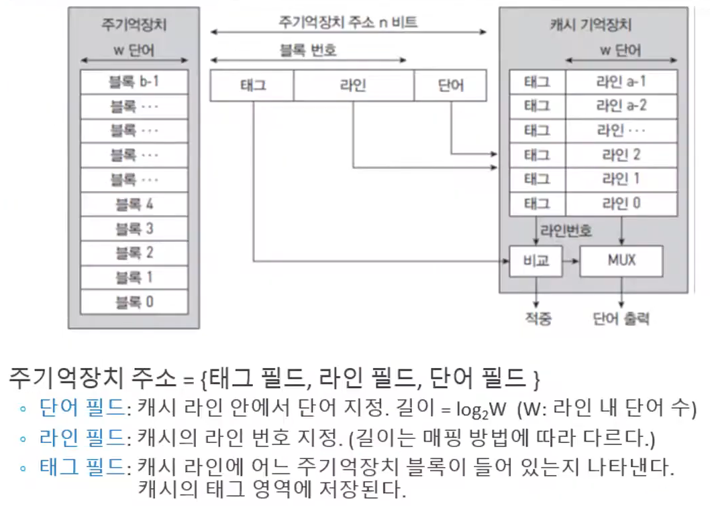
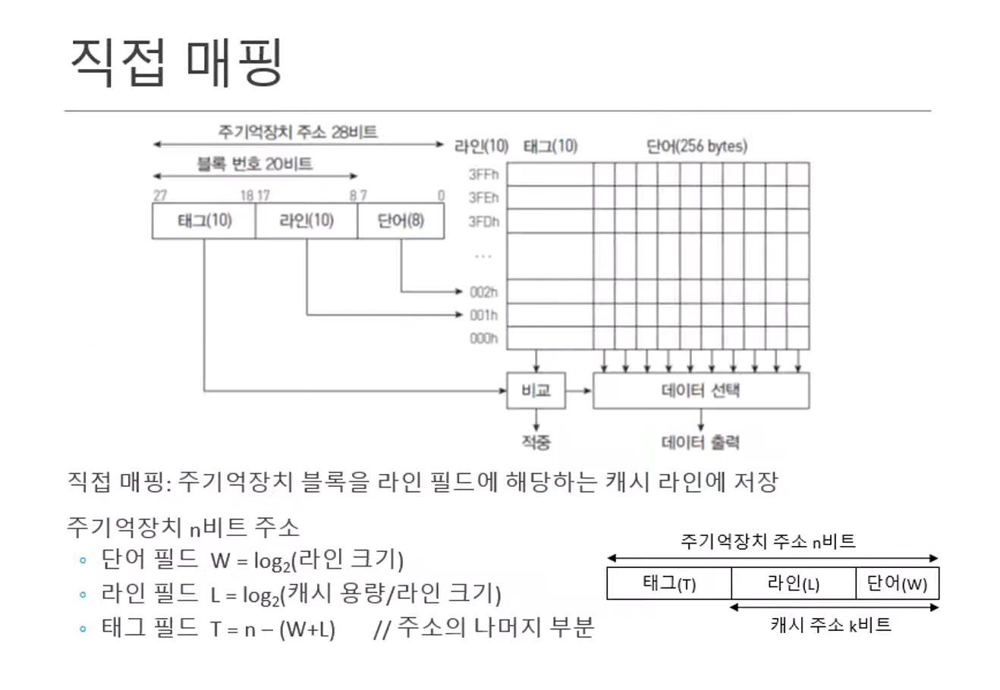
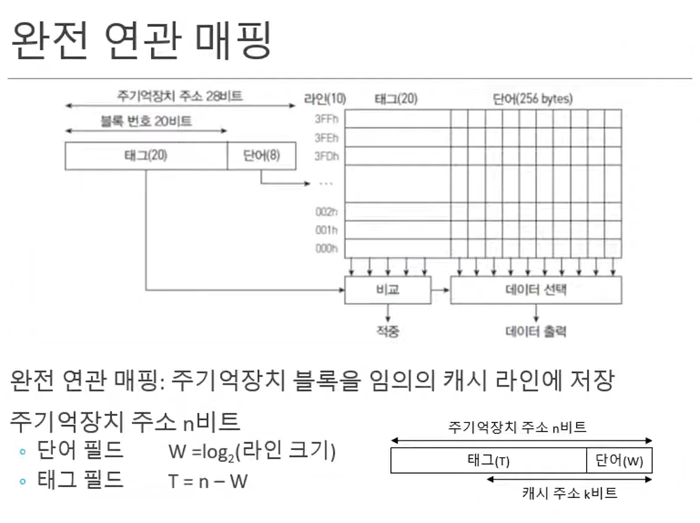
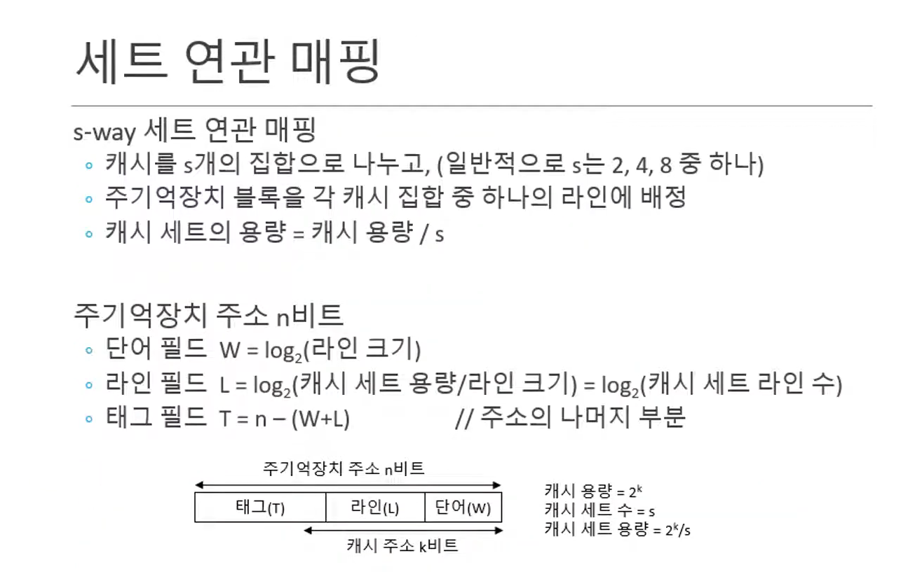
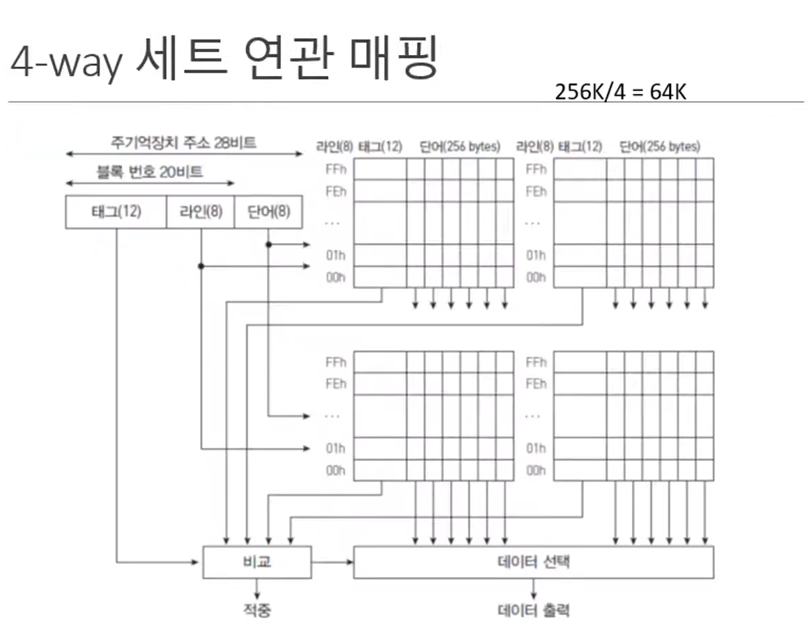

# 캐싱 라인

[유튜브 영상](https://www.youtube.com/watch?v=WOZ2U8Fdg5U&t=0s&ab_channel=%EC%B6%A9%EB%B6%81%EB%8C%80%ED%95%99%EA%B5%90_%EC%86%8C%ED%94%84%ED%8A%B8%EC%9B%A8%EC%96%B4%ED%95%99%EB%B6%80)

메인 -> 캐시 전송 단위 : 블록 /  캐시 -> 메인 전송 단위 : 라인

일반적으로는 블록과 라인의 크기를 일치시킴

- 캐시의 용량은 (단어 + 라인) 부분만 포함한다.
- 태그는 어떤 블록인지 의미한다. 캐시의 'key 필드'
- 캐시가 있더라도 CPU는 주기억장치 주소를 쓰기 때문에, n비트를 전부 다 사용한다.
  - 주기억장치에 저장된 태그와 캐시기억장치에 있는 태그를 비교한다.
  - 근데 이걸 하나씩 비교하면 오래 걸려서 동시에 비교한다.

캐시 메모리에 있는 데이터를 찾기 위해 항상 전체를 탐색해야한다면 캐시의 장점을 잃게된다.

따라서 ==캐싱 라인==이라는 특정 자료구조를 사용해 캐시 데이터를 묶음으로 저장한다. 빈번하게 사용되는 데이터의 주소들이 흩어져있기 때문에, 캐시에 저장하는 데이터에는 **데이터의 주소**를 기록해둔 태그를 달아야한다. 이러한 태그들의 묶음을 의미한다.

## 주기억장치의 블록을 캐시의 라인에 어떻게 가져올 것인가?

### 1. Direct Mapping

- 메인 메모리를 일정한 크기의 블록으로 나누어, 각각의 블록을 캐시의 정해진 위치에 맵핑한다.
- 주기억장치 블록이 저장될 캐시 라인이 하나로 고정된다. => 교체 정책이 필요하지 않다. (캐시가 다 찼을 때 새로운 데이터를 어디에 저장할지 고민하는 것이다.)
- 가장 간단하지만 적중률이 낮아질 수 있다. 또한 동일한 캐시 메모리에 할당된 여러 데이터를 사용할 때 충돌이 발생한다.
- 같은 캐시 라인으로 매핑되는 두개의 블록을 번갈아 사용하면 효율이 떨어진다. (같은 위치를 사용하는 블록이 여러개면, A를 저장해놨다가 B를 조회하면 캐시에 B로 교체하고, 다시 A로 교체하고 등등.. 그러니까 충돌날 때 매우 비효율적)

> 메모리 주소가 XX였던 애는 캐시에 AA에만 저장될 수 있다. 그 외의 위치는 쓸 수 없어. 그래서 찾는건 빨라.
>
> 그런데 우연의 일치로 캐시의 AA 위치를 여러 데이터가 써야한다고 하면.. 계속 올렸다 내렸다를 반복해야해

### 2. Full Associative Mapping

- 캐시 메모리의 빈 공간에 마음대로 주소를 저장한다. 
  - 해당 위치를 사용하고 있다고 표기하기 위해 태그에 값을 전부 다 저장한다.
- 저장은 쉽지만 원하는 데이터가 있는지 찾기 위해선 ==모든 태그==를 비교해야한다.

> 아무데나 저장할 수 있어. 그래서 캐시가 다 찼다면 교체를 해줘야해서 교체 정책이 필요해.
>
> 그리고 어디에 저장되어있는지 알려면 캐시안에 저장되어있는 모든 태그를 비교해야해. 비교연산이 너무 많아..
>
> 이론으로 존재하는 개념

### 3. Set Associative Mapping

- 빈 공간에 마음대로 주소를 저장하되, 미리 정해둔 특정 행에만 저장한다. 
- Direct에 비해 검색 속도는 느리지만 저장이 빠르고, Full에 비해 저장은 느리지만 검색이 빠르다.

### 집합을 4개로 설정한 경우

- 세트당 라인 수가 집합의 개수에 비례해 줄어든다.
- 라인에 해당되는 위치가 4개가 되기 때문에 그 중에 하나에 집어넣는다.
  - 같은 라인번호로 겹치더라도 세트가 여러개니까 그 중에 하나를 선택할 수 있다.
  - 라인이 아까 직접맵핑은 10비트였는데 8비트가 된 것은 4로 나눴기 때문이다.
- 하나의 라인에 대헤 태그가 4개가 나오기 때문에, 비교연산을 확실히 줄일 수 있다.