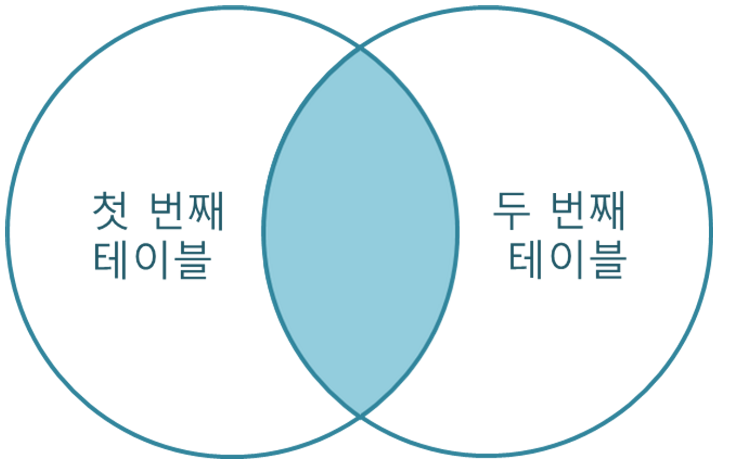
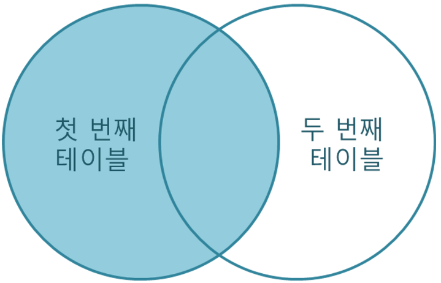
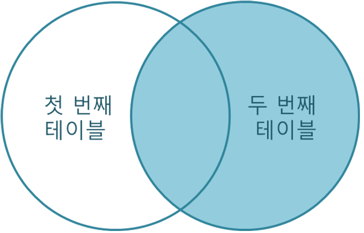

[TOC]


# ⭐ WHERE

- `BETWEEN A AND B`

  ```sql
  // 2개의 조건이 필요한 경우
  SELECT COUNT(USER_ID) AS 'USERS'
  FROM USER_INFO
  WHERE JOINED BETWEEN '2021-01-01' AND '2021-12-31' AND AGE BETWEEN 20 AND 29;
  ```

- `IN (리스트)`

- `LIKE 문자열`

  - `%` : 0개 이상의 문자
  - `_` : 1개의 단일 문자

- `IS NULL` : NULL은 등호로 판단 X

- 프로그래머스 참고

  https://school.programmers.co.kr/questions/38186

  ### **`WHERE` 구의 조건을 활용한 풀이**

  `COUNT` 함수를 사용할 때는 전체(`*`)를 대상으로 할 때 주의해야 합니다. `COUNT(*)`는 `NULL` 값을 포함하고 `COUNT(AGE)`와 같이 특정 컬럼을 지정해줄 경우 `NULL` 값을 포함하지 않기 때문입니다. 이 문제에서는 `WHERE` 구에서 이미 조건을 수행하기 때문에 괜찮지만 다른 문제에서는 주의하시면 좋을 것 같습니다.

  ```sql
  SELECT COUNT(USER_ID) AS USERS
  FROM USER_INFO
  WHERE AGE IS NULL;
  ```

  예를 들어 이 문제에서 아래 쿼리와

  ```sql
  SELECT COUNT(*) AS USERS
  FROM USER_INFO;
  ```

  아래 쿼리는 반환하는 결괏값이 다릅니다.

  ```sql
  SELECT COUNT(AGE) AS USERS
  FROM USER_INFO;
  ```

  왜냐하면 앞서 말씀드린 것처럼 `COUNT(*)`는 `NULL` 값을 포함해 전체 개수를 세기 때문에 `NULL` 값을 제외하고 개수를 세는 `COUNT(AGE)`보다 결과가 크게 나옵니다.

  ### **`SUM` 함수를 사용한 풀이**

  조건을 충족하는 참(True)은 곧 `1`을, 충족하지 못하는 거짓은 곧 `0`인 논리를 활용한 풀이입니다. `SUM` 함수 내에 있는 `AGE IS NULL`이라는 조건을 충족하는 경우에만 `1`로 변환되어 값이 더해지기 때문에 원하는 정답을 구할 수 있습니다.

  ```sql
  SELECT SUM(AGE IS NULL) AS USERS
  FROM USER_INFO;
  ```


# ⭐ GROUP BY, HAVING

### 집계함수

- `COUNT()` : 행 수 출력

  - `COUNT(*)` : NULL 포함

  - `COUNT(표현식)` : NULL 제외

  - `ALL` : 전체 출력

- `DISTINCT` : 중복 제외 출력

- 그외 집계 함수

  - `SUM(컬럼) , AVG(컬럼), MAX(컬럼), MIN(컬럼), VARIAN(컬럼), STDDEV(컬럼)` : NULL 제외하고 연산

- `GROUP BY` : 그룹핑 기준 (앨리어스 X)

- `HAVING` : GROUP BY 절에 의한 집계 데이터에 **출력 조건** 을 설정.

  - WHERE 절은 SELECT절에 조건을 걸기 때문에 제외된 데이터가 GROUP BY 대상이 아니다.

    ```sql
    SELECT USER_ID, PRODUCT_ID
    FROM ONLINE_SALE
    GROUP BY USER_ID, PRODUCT_ID
    // GROUP BY 절에는 HAVING을 사용해야함. 
    HAVING COUNT(USER_ID) >= 2
    ORDER BY USER_ID ASC, PRODUCT_ID DESC;
    ```


### GROUP BY 와 MYSQL

https://school.programmers.co.kr/questions/38703

아래와 같은 `Orders` 테이블이 있다고 가정해봅시다.

```
+------+---------+-------+
| id   | revenue | month |
+------+---------+-------+
| 1    | 8000    | Jan   |
| 2    | 7000    | Jan   |
| 3    | 6000    | Jan   |
+------+---------+-------+
```

만약 우리가 `month` 필드를 기준으로 `revenue` 필드의 값들 중 가장 큰 값을 반환하고 그 값의 `id` 필드의 값도 반환하고 싶다면 어떻게 해야 할까요? 해당 문제를 푸는 접근 방식은 이번 문제와 유사합니다. 그래서 만약 아래와 같이 쿼리문을 작성하면 어떻게 될까요?

```
SELECT
  id,
  month,
  MAX(revenue) AS revenue
FROM Orders
GROUP BY month
```

`revenue` 필드의 값은 집계함수 `MAX`를 사용했기 때문에 복수의 필드 중 어떤 값을 반환해야 하는지 결정이 되었고 `month` 필드 또한 `GROUP BY` 구의 기준이기 때문에 반환해야 하는 값이 명확히 정해져 있습니다. 그런데 `id` 필드는 어떨까요? 그룹으로 묶이기 전을 한 번 테이블로 표시하면 아래와 같은 상태일 겁니다.

```
+------+---------+-------+
| id   | revenue | month |
+------+---------+-------+
| 1    | 8000    | Jan   |
| 2    | 8000    | Jan   |
| 3    | 8000    | Jan   |
+------+---------+-------+
```

다시 말해 DBMS 입장에서는 어떤 `id` 필드의 값을 반환해야 하는지 알 수 없기 때문에 오류를 반환하게 됩니다. 이게 기본적인 MySQL의 작동 방식입니다. 그런데 프로그래머스에서 위 쿼리를 실행하면 아마 오류가 발생하지 않고 `id` 필드의 값으로 `1` 혹은 어떤 값들 중 임의의 값 하나를 무작위로 반환할 것입니다.

이는 MySQL 내에 존재하는 `sql_mode` 값 때문입니다. 관련해서 자세한 내용은 MySQL 공식 문서의 [SQL 모드](https://dev.mysql.com/doc/refman/5.7/en/sql-mode.html) 부분을 확인하시길 바랍니다.

먼저 아래와 같이 프로그래머스가 어떤 `sql_mode` 값을 가지고 있는지 조회해보면 `NULL`이 반환되는 걸 확인할 수 있습니다.

```
SELECT @sql_mode;
```

우리의 상황에서는 `GROUP BY` 부분이 궁금하므로 MySQL의 SQL 모드 중 `GROUP BY` 구와 연관된 `ONLY_FULL_GROUP_BY`라는 옵션이 `sql_mode` 테이블의 값으로 존재하는지 확인해보면 되는데 위에서 확인해본 것처럼 프로그래머스의 MySQL 서버에는 어떤 값도 존재하지 않습니다.

`ONLY_FULL_GROUP_BY` 옵션의 경우 기본적으로는 존재하며 이 값이 존재할 경우 `GROUP BY` 구를 사용할 때 집계 함수 등으로 선택되지 못해 임의의 값 중 어떤 값을 반환해야 할 지 모르는 필드가 존재하면 오류를 반환하게 되어있습니다. 그런데 프로그래머스 MySQL 서버의 경우 어떠한 모드도 취하고 있지 않고 있기 때문에 해당 `ONLY_FULL_GROUP_BY` 옵션이 꺼져있는 상태입니다. 따라서 결과적으로 MySQL 내부에서 어떤 값을 골라야 할 지 모르는 임의의 값 중 무작위로 하나의 값을 고르게 되고 보통 자동적으로 가장 첫 번째 값을 고르게 되어 있습니다.

다시 원점으로 돌아와서, 결국 `GROUP BY` 구의 기준이 되는 필드가 아니거나 집계 함수를 통해 어떤 값을 반환해야 할 지 결정해주지 않은 필드를 `SELECT` 구에 사용할 경우 문법적으로 틀린 SQL 구문입니다. `GROUP BY` 구 사용과 관련하여 헷갈리는 분들은 이 부분 유의하여 한 번 다시 접근해보면 좋을 것 같습니다.


[2개의 테이블에서 하나의 테이블에 3번 이상 등장한 컬럼 찾기](https://school.programmers.co.kr/learn/courses/30/lessons/164670)

- 틀린 답변

```sql
SELECT USER_ID, NICKNAME, CONCAT_WS(' ', CITY, STREET_ADDRESS1, STREET_ADDRESS2) AS 전체주소, CONCAT_WS('-', SUBSTRING(TLNO,1, 3), SUBSTRING(TLNO, 4, 4), SUBSTRING(TLNO, 7, 4)) AS 전화번호
FROM USED_GOODS_BOARD, USED_GOODS_USER
WHERE WRITER_ID = USER_ID
GROUP BY USER_ID
HAVING COUNT(USER_ID) >= 3
ORDER BY USER_ID DESC
```

- 틀린 이유

  => 해당 쿼리문에서 문제점은 `GROUP BY`절에 `USER_ID`만을 사용하고 `NICKNAME`, `CITY`, `STREET_ADDRESS1`, `STREET_ADDRESS2`, `TLNO` 컬럼들을 `GROUP BY`절에 넣지 않았다는 것입니다. 이는 `GROUP BY`절에서 `USER_ID`로 그룹화를 한 뒤, 그룹화된 데이터에서 `NICKNAME`, `CITY`, `STREET_ADDRESS1`, `STREET_ADDRESS2`, `TLNO` 컬럼들의 어떤 값을 가져와야 할 지 알 수 없게 됩니다.

  GROUP BY 절에서는 집계 함수를 사용하지 않은 컬럼은 GROUP BY 절에 반드시 명시해주어야 합니다. 그 이유는 GROUP BY 절이 그룹으로 묶여진 각각의 레코드가 어떤 기준으로 그룹화되었는지 명시하기 때문입니다.

  즉, 위의 쿼리문에서 GROUP BY USER_ID를 하면, 각 USER_ID 그룹의 첫 번째 레코드의 나머지 컬럼들의 값을 가져와야 합니다. 하지만, 이는 MySQL의 동작 방식과는 맞지 않습니다. **MySQL에서는 GROUP BY 절에 명시되지 않은 나머지 컬럼들은 MySQL 엔진이 임의로 선택하기 때문에, GROUP BY절에서 나머지 컬럼들을 명시하지 않으면 오류가 발생할 수 있습니다.**

  따라서, 위의 쿼리문에서는 SELECT절에 나열한 모든 컬럼들을 GROUP BY 절에 명시해주는 것이 좋습니다.


# ⭐ JOIN

<aside> ✅ SELECT 절에 사용되며 여러 테이블을 연결, 결합하여 데이터를 출력한다.</aside>


표준 SQL에서는 레코드를 조합하는 방식에 따라 JOIN을 다음과 같이 구분합니다.

1. INNER JOIN (My SQL에선 CROSS JOIN과 동일)
2. LEFT JOIN
3. RIGHT JOIN


## 1. INNER JOIN



```sql
SELECT *
FROM A
JOIN B
ON A.COL = B.COL

// My SQL 에서만 가능한 다른 방식
SELECT *
FROM A, B
WHERE A.COL = B.COL (등가조인. 두 테이블의 컬럼 값이 정확히 일치)
```

- ON 절에서는 WHERE 절에서 사용할 수 있는 모든 조건을 사용할 수 있습니다.
- 표준 SQL과는 달리 MySQL에서는 JOIN, INNER JOIN, CROSS JOIN이 모두 같은 의미로 사용됩니다.


## 2. LEFT JOIN



LEFT JOIN은 첫 번째 테이블을 기준으로, 두 번째 테이블을 조합하는 JOIN입니다.

- 이때 ON 절의 조건을 만족하지 않는 경우에는 첫 번째 테이블의 필드 값은 그대로 가져옵니다.
- 하지만 해당 레코드의 **두 번째 테이블의 필드 값은 모두 NULL로 표시됩니다.**

```sql
SELECT *
FROM A
LEFT JOIN B
ON A.COL = B.COL
(WHERE 조건) <- 필요하면
```

- ON 절에서는 WHERE 절에서 사용할 수 있는 모든 조건을 사용할 수 있습니다.

```sql
// 여러 테이블 조인 가능
SELECT * FROM t1 LEFT JOIN (t2, t3, t4)
                 ON (t2.a = t1.a AND t3.b = t1.b AND t4.c = t1.c)

// 컬럼 명이 같다면 USING 사용 가능
a LEFT JOIN b USING (c1, c2, c3)
```


## 3. RIGHT JOIN



RIGHT JOIN은 LEFT 조인과는 반대로 **두 번째 테이블을 기준으로**, 첫 번째 테이블을 조합하는 JOIN입니다.

- 이때 ON 절의 조건을 만족하지 않는 경우에는 두 번째 테이블의 필드 값은 그대로 가져옵니다.
- 하지만 해당 레코드의 **첫 번째 테이블의 필드 값은 모두 NULL로 표시됩니다.**

```sql
SELECT *
FROM A
RIGHT JOIN B
ON A.COL = B.COL
(WHERE 조건)
```


## [4. CROSS JOIN](https://www.mysqltutorial.org/mysql-cross-join/)

- 두 테이블의 모든 행을 조합한다. A테이블의 행이 N개이고, B테이블의 행이 M개이면 결과는 N*M개이다.
- Cartesian product와 같은 말이다.
- 다른 조인과 달리 어떤 column을 기준으로 join할 것인지 조건을 정하지 않는다. 만약 `where` 절을 사용하여 `t1.id = t2.id` 를 한다면 inner join과 같은 결과가 나온다.

```sql
SELECT * FROM t1
CROSS JOIN t2;
```


## [5. SELF JOIN](https://www.mysqltutorial.org/mysql-self-join/)

- 테이블 자신 자체와 JOIN하는 방법이다. 

- 행을 동일한 테이블 내의 다른 행과 비교하는데 사용한다.
- 단일 쿼리에서 동일한 테이블 이름을 두번 반복하지 않도록 ALIAS를 설정해야한다. (안하면 오류 발생)

- `INNER JOIN` 또는 `LEFT JOIN`으로 구현한다. 

```sql
SELECT 
    c1.city, 
    c1.customerName, 
    c2.customerName
FROM
    customers c1
INNER JOIN customers c2 ON 
    c1.city = c2.city
    -- 아래 구절은 다른 값을 가진 경우만 찾아낸다.
    AND c1.customername > c2.customerName
ORDER BY 
    c1.city;
```


# 함수

[MySQL :: MySQL 8.0 Reference Manual :: 12 Functions and Operators](https://dev.mysql.com/doc/refman/8.0/en/functions.html)


## 단일 행 함수

SELECT, WHERE, ORDER BY 절에 사용 가능하며 각 행에 개별적으로 작용


### 제어 흐름 함수

- `SELECT IF(수식, 참일때 값, 거짓일때 값)` : 수식이 참일 때와 거짓일 때

- `CASE .. WHEN .. ELSE .. END`

  ```sql
  SELECT CASE 10 -- CASE ... WHEN ... ELSE ... END
      WHEN 1 THEN 'a'
      WHEN 5 THEN 'e'
      WHEN 10 THEN 'j'
      ELSE '?'
  END;
  ```

- 조건이 필요할 때

  조건 : ‘Neutered’ 또는 ‘Spayed’ 를 포함하면 O, 아니면 X를 출력하라

  ```sql
  // IF 절 사용
  SELECT ANIMAL_ID, NAME, 
  IF(SEX_UPON_INTAKE LIKE '%Neutered%' OR SEX_UPON_INTAKE LIKE '%Spayed%', 'O', 'X')
  FROM ANIMAL_INS
  ORDER BY ANIMAL_ID;
  
  // CASE 사용
  SELECT ANIMAL_ID, NAME, 
      CASE
          WHEN SEX_UPON_INTAKE LIKE '%Neutered%' OR SEX_UPON_INTAKE LIKE '%Spayed%' THEN 'O'
          ELSE 'X' END AS '중성화'
  FROM ANIMAL_INS
  ORDER BY ANIMAL_ID;
  ```


### [문자열 함수](https://dev.mysql.com/doc/refman/8.0/en/string-functions.html)

- 대문자, 소문자 : `LOWER(문자열), UPPER(문자열)`

- 길이 : `LENGTH(문자열)` 

- 부분 문자열의 시작 위치 찾기 : `LOCATE(substr, str)` 또는 `LOCATE(substr, str, pos)`

  str에서 substr이 처음 나타나는 위치를 반환합니다. 또는 pos에서 시작하여 tr에서 하위 문자열 substr이 처음 나타나는 위치를 반환합니다. substr이 str에 없으면 0을 반환합니다. NULL이면 NULL을 반환합니다.

  ```sql
  SELECT LOCATE('bar', 'foobarbar'); -> 4
  SELECT LOCATE('xbar', 'foobar'); -> 0
  SELECT LOCATE('bar', 'foobarbar', 5); -> 7
  ```

- 문자열 자르기 : `SUBSTRING(문자열, 위치)` =  `SUBSTRING(문자열 FROM 위치)`

  - `SUBSTRING(문자열, 위치, 길이)` : 위치에서 길이 까지 자름
  - 위치는 음수도 가능(뒤에서부터 자름)
  - 위치가 0이면 빈 문자열 반환

  ```sql
  SELECT SUBSTRING('Quadratically',5); -> 'ratically'
  SELECT SUBSTRING('foobarbar' FROM 4); -> 'barbar'
  SELECT SUBSTRING('Quadratically',5,6); -> 'ratica'
  SELECT SUBSTRING('Sakila', -3); -> 'ila'
  SELECT SUBSTRING('Sakila', -5, 3); -> 'aki'
  SELECT SUBSTRING('Sakila' FROM -4 FOR 2); -> 'ki'
  ```

- 문자열 왼쪽 / 오른쪽에서 '길이'만큼 자르기 : `LEFT(문자열, 길이)` , `RIGHT(문자열, 길이)` 

  ```sql
  SELECT LEFT('foobarbar', 5); -> 'fooba'
  SELECT RIGHT('foobarbar', 4); -> 'rbar'
  ```

- 정규식 사용하기

  ```sql
  IF (컬럼명 REGEXP 수식, 참, 거짓)
  ex ) IF(SEX_UPON_INTAKE REGEXP 'Neutered|Spayed', 'O', 'X') 중성화
  // SEX_UPON_INTAKE에 'Neutered 또는 Spayed'가 포함된 경우
  ```

- 문자열 합치기 : `CONCAT(문자열, 문자열, 문자열 ...)` , `CONCAT_WS(구분자, 문자열, 문자열, 문자열 ..)`

  ```sql
  SELECT CONCAT('My', 'S', 'QL');
          -> 'MySQL'
  SELECT CONCAT('My', NULL, 'QL');
          -> NULL
  SELECT CONCAT(14.3); // 숫자를 문자열로 변환 가능
          -> '14.3'
  SELECT 'My' 'S' 'QL';
          -> 'MySQL'
          
  // 첫 번째 인자는 seperator
  SELECT CONCAT_WS(',','First name','Second name','Last Name');
          -> 'First name,Second name,Last Name'
  // 빈 문자열은 스킵하지 않지만, NULL은 스킵함
  SELECT CONCAT_WS(',','First name',NULL,'Last Name');
          -> 'First name,Last Name'
  ```


### 숫자, 수학 함수

- `CEILING(숫자)`, `FLOOR(숫자)` , `ROUND(숫자)`

- `MOD(숫자1, 숫자2)` = 숫자1 % 숫자2

- `POW(숫자1, 숫자2)` , `SQRT(숫자)`

- `RAND()` : 0 ~ 1 무작위 실수

- `SIGN(숫자)` : 양수면 1, 음수면 -1, 0이면 0

- `TRUNCATE(숫자, 자릿수)` : 자릿수 까지만 저장하고 나머진 버림.

  ```sql
  SELECT TRUNCATE(1234.1234, 2), => 1234.12
         TRUNCATE(1234.1234, -2);  => 1200
  ```


### 날짜, 시간 함수

- `CUREDATE()` : YYYY-MM-DD

- `CURTIME()` : hh:mm:ss

- `NOW(), SYSDATE()` : ‘연-월-일 시:분:초’

- `DATE_FORMAT(date, format)` : 입력받은 date값을 format에 맞춰 바꿔줌

  숫자

  | 범위     | 형태   | 결과            |
  | -------- | ------ | --------------- |
  | 연       | %Y     | 2023            |
  | 연       | %y     | 23              |
  | 월       | %m     | 00 ~ 12         |
  | 월       | %c     | 0 ~ 12          |
  | 일       | %d     | 00 ~ 31         |
  | 일       | %e     | 0 ~ 31          |
  | 시       | %H     | 00 ~ 23         |
  | 시       | %k     | 0 ~ 23          |
  | 시       | %h, %I | 01 ~ 12         |
  | 시       | %l     | 1 ~ 12          |
  | 분       | %i     | 00 ~ 59         |
  | 초       | %S, %s | 00 ~ 59         |
  | 시간     | %T     | 16:42:01        |
  | 마이크로 | %f     | 000000 ~ 999999 |

  문자열

  | 범위 | 형태 | 결과            |
  | ---- | ---- | --------------- |
  | 월   | %M   | April           |
  | 월   | %b   | Apr             |
  | 일   | %D   | 0th, 1st, 2nd.. |
  | 주   | %a   | Sun             |
  | 시   | %p   | AM/PM           |

- `DATE(입력 시간)` : 입력 시간에서 시간을 빼고 YYYY-MM-DD 만 남김

  ```sql
  SELECT DATE('2003-12-31 01:02:03');        -> '2003-12-31'
  ```

- `YEAR()`, `MONTH()`, `DAY()`  == `DAYOFMONTH()`, `HOUR()` ,`MINUTE()`, `SECOND()`, `MICROSECOND()`

  ```sql
  SELECT YEAR('1987-01-01');        -> 1987
  SELECT MONTH('2008-02-03');        -> 2
  SELECT DAY('2007-02-03');        -> 3
  // NULL 이면 NULL
  SELECT HOUR('10:05:03');        -> 10
  SELECT HOUR('272:59:59');        -> 272
  SELECT MINUTE('2008-02-03 10:05:03');        -> 5
  SELECT SECOND('10:05:03');        -> 3
  SELECT MICROSECOND('12:00:00.123456');        -> 123456
  ```

- `DATEDIFF(날짜1, 날짜2)` : 날짜1 에서 날짜2의 차이만큼을 ‘일’수로 계산해서 반환함

  - 날짜1이 더 미래여야 양수가 나옴

### NULL 관련 함수

- `SELECT IFNULL(수식1, 수식2)` : 수식1이 NULL이면 수식2를 반환하고, 아니면 수식 1 반환

- `SELECT NULLIF(수식1, 수식2)` : 수식1과 수식2가 같다면 NULL, 아니라면 수식1 반환

- ```
  SELECT A, B COALESCE(A, B)
  ```

   : 인자로 주어진 컬럼들 중에서 NULL이 아닌 첫 번째 값을 반환

  - A = 1, B = NULL  ⇒ COALESCE(A,B) = 1
  - A = NULL, B = 2 ⇒ COALESCE(A,B) = 2
  - A =NULL, B = NULL ⇒ COALESCE(A, B) = NULL


# 서브쿼리

<aside> ✅ 서브쿼리(subquery)란 하나의 SQL문 안에서 다른 SQL문을 포함시키는 것입니다. 서브쿼리는 외부 쿼리에 의해 실행되는 쿼리이기 때문에, 외부 쿼리의 결과에 영향을 미치지 않으며, 중첩된 SELECT 문으로 구성됩니다.</aside>


## 서브쿼리를 사용해야하는 경우

1. 복잡한 질의 서브쿼리는 SELECT 문이 아니라도, 다른 SQL문의 일부로 사용할 수 있습니다. 서브쿼리를 사용하여 필요한 정보만 추출하고, 그 결과를 다시 다른 쿼리문에서 사용할 수 있습니다. 이렇게 하면, 하나의 복잡한 SQL문 대신, 여러 개의 단순한 SQL문을 작성할 수 있습니다.
2. 집계함수 사용 서브쿼리를 사용하면 집계함수를 사용하여 부분적인 값을 계산할 수 있습니다. 예를 들어, 특정 조건을 만족하는 레코드의 수, 평균값, 최댓값, 최솟값 등을 계산할 때, 서브쿼리를 사용할 수 있습니다.
3. 데이터베이스 설계 서브쿼리는 데이터베이스 설계 과정에서도 유용하게 사용됩니다. 예를 들어, 서브쿼리를 사용하여 뷰(View)를 생성할 수 있습니다. 뷰는 데이터베이스의 일부분만을 추출하여 보여주는 가상 테이블입니다. 이렇게 하면, 데이터베이스의 중복성을 줄일 수 있으며, 관리 및 유지보수를 편리하게 할 수 있습니다.
4. 성능 향상 서브쿼리는 성능 저하를 유발할 수 있습니다. 하지만, 서브쿼리를 사용하면 복잡한 질의를 처리할 때, 성능을 향상시킬 수 있습니다. 예를 들어, 서브쿼리를 사용하여 중복 제거를 할 수 있습니다. 이 경우, INNER JOIN을 사용한 경우보다 성능이 더 우수합니다.

따라서, 서브쿼리는 복잡한 질의나 데이터베이스 설계 과정에서 유용하게 사용됩니다. 하지만, 성능 저하를 유발할 수 있기 때문에, 적절한 상황에서만 사용해야 합니다.

- GROUP BY + 서브쿼리 예시

  https://school.programmers.co.kr/learn/courses/30/lessons/131123

  ```sql
  SELECT FOOD_TYPE, REST_ID, REST_NAME, FAVORITES
  FROM REST_INFO
  WHERE (FOOD_TYPE, FAVORITES) IN (
  		// FOOD_TYPE과 MAX(FAVORITES)를 짝지은 결과
      SELECT FOOD_TYPE, MAX(FAVORITES)
      FROM REST_INFO
      GROUP BY FOOD_TYPE
  )
  ORDER BY FOOD_TYPE DESC;
  ```

  - 서브쿼리를 사용하여 음식 종류별로 가장 많은 즐겨찾기수를 가진 식당의 정보를 찾고, 이를 기반으로 전체 테이블에서 해당 정보를 조회합니다. 그리고 결과를 음식 종류를 기준으로 내림차순으로 정렬합니다.


# 윈도우 함수

윈도우 함수는 각 행에 대해 정의된 "윈도우" 또는 연관된 행의 집합을 기반으로 연산을 수행합니다. 윈도우 함수를 사용하면 복잡한 집계, 순위 및 이동 평균과 같은 연산을 쉽게 처리할 수 있으며, 데이터 분석에 매우 유용한 도구입니다.

```sql
<window_function> (<expression>) OVER (
    [PARTITION BY <partition_expression>]
    [ORDER BY <order_expression> [ASC|DESC]]
    [ROWS|RANGE <frame_extent>]
)
```

1. `<window_function>`: 사용하려는 윈도우 함수입니다. 예를 들어, `SUM`, `AVG`, `ROW_NUMBER`, `RANK`, `DENSE_RANK`, `NTILE`, `LEAD`, `LAG` 등이 있습니다. 집계함수처럼 작동하지만, 집계함수는 결과를 하나의 행으로 반환하는데에 비해 윈도우 함수는 계산이 수행된 모든 행을 반환합니다.
2. `<expression>`: 윈도우 함수에 대한 입력값입니다. 일반적으로 열 이름이나 계산식을 사용합니다.
3. `PARTITION BY`: 행을 그룹으로 나누는 데 사용되며, 각 파티션에 대해 윈도우 함수가 개별적으로 수행됩니다. 이 구문은 생략할 수 있습니다.
4. `ORDER BY`: 윈도우 내에서 행의 순서를 지정하는 데 사용됩니다. 이 구문은 생략할 수 있습니다.
5. `ROWS|RANGE`: 윈도우 프레임을 정의하는 데 사용되며, 프레임 내의 행에 대해 윈도우 함수가 적용됩니다. 이 구문은 생략할 수 있습니다.


예제1 )

```sql
SELECT
    product_category,
    order_date,
    sales,
    SUM(sales) OVER (PARTITION BY product_category ORDER BY order_date) AS cumulative_sales
FROM
    sales_data;
```

이 쿼리는 `sales_data` 테이블에서 각 `product_category`별 `order_date`에 따라 누적 판매량(cumulative sales)을 계산합니다. 


예제2)

```sql
SELECT REST_ID, REST_NAME, FOOD_TYPE, FAVORITES
FROM (
  SELECT REST_ID, REST_NAME, FOOD_TYPE, FAVORITES,
    RANK() OVER (PARTITION BY FOOD_TYPE ORDER BY FAVORITES DESC) AS rank
  FROM REST_INFO
) sub
WHERE rank = 1
ORDER BY FOOD_TYPE DESC;
```

- `RANK()`: 동일한 값이 있는 경우 동일한 순위 부여. 이후 순위를 건너뛰지 않고 중복된 순위를 부여한다.
  - EX) 1,2,2,3,4,4,4,5 → 1,2,2,3,4,4,4,5
- `OVER()` : 행 단위로 윈도우를 지정하여, 윈도우 내 특정 컬럼의 값을 연산. PARTITION BY, ORDER BY, ROWS/RANGE BETWEEN 등의 옵션을 사용하여 윈도우 범위 지정
- `RANK()` 와 `OVER()` 함수를 사용하여 FOOD_TYPE 별로 FAVORITES 값을 내림차순으로 정렬하고 각 레코드에 대한 순위를 구함
- 이를 sub 쿼리로 구성한 후, 메인 쿼리에서 where 절을 이용해 가장 큰 FAVORITES 값을 갖는 레코드 조회
- 이 방법은 서브쿼리나 JOIN을 사용하는 것보다 가독성이 높으며, 일부 경우에는 더 빠른 성능을 보일 수 있습니다. 하지만 대용량 데이터를 다룰 때는 성능 문제가 발생할 수 있으므로, 적절한 인덱스를 사용하는 것이 중요합니다.


# UNION , UNION ALL

MySQL의 `UNION` 연산자는 두 개 이상의 `SELECT` 문을 결합하여 결과 집합을 생성하는 데 사용됩니다. 이 연산자는 각각 다른 `SELECT` 문에서 가져온 행을 **하나의 결과 집합으로 합칠 때 유용**합니다. `UNION`은 중복된 행을 제거하여 결과를 반환합니다. 중복된 행을 포함하고자 할 때는 `UNION ALL`을 사용할 수 있습니다.

`UNION`을 사용하려면 다음 조건이 충족되어야 합니다:

1. 결합하려는 `SELECT` 문의 수가 동일해야 합니다.
2. 해당 열의 **데이터 형식이 호환**되어야 합니다.

### `UNION` 사용 예제:

```sql
-- 첫 번째 SELECT 문
SELECT column1, column2, column3
FROM table1
WHERE condition1

-- UNION 연산자를 사용하여 두 번째 SELECT 문과 결합
UNION

-- 두 번째 SELECT 문
SELECT column1, column2, column3
FROM table2
WHERE condition2;
```

### `UNION ALL` 사용 예제:

```sql
SELECT column1, column2, column3
FROM table1
WHERE condition1

UNION ALL

SELECT column1, column2, column3
FROM table2
WHERE condition2;
```

참고로 `UNION`을 사용할 때 주의할 점은 다음과 같습니다:

- `UNION`은 기본적으로 **중복된 결과 행을 제거하므로 추가적인 비용이 발생**할 수 있습니다. 가능하면 `UNION ALL`을 사용하여 중복 제거 작업을 건너뛸 수 있습니다.
- 각 `SELECT` 문의 순서에 따라 결과 집합의 열 이름이 결정됩니다. 첫 번째 `SELECT` 문의 열 이름이 결과 집합의 열 이름으로 사용됩니다. 원하는 열 이름을 지정하려면 첫 번째 `SELECT` 문에서 별칭을 사용하면 됩니다.
- `UNION`은 각각 다른 `SELECT` 문에서 가져온 행을 결합하기 때문에, 적절한 조건을 설정하여 의도한 결과 집합을 얻는 것이 중요합니다.