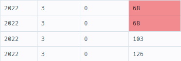

# 프로그래머스 SQL 문제 LV4 풀이


[TOC]

## [보호소에서 중성화한 동물](https://school.programmers.co.kr/learn/courses/30/lessons/59045)

- 자료

  -  `ANIMAL_INS` 테이블 구조는 다음과 같으며, `ANIMAL_ID`, `ANIMAL_TYPE`, `DATETIME`, `INTAKE_CONDITION`, `NAME`, `SEX_UPON_INTAKE`는 각각 동물의 아이디, 생물 종, 보호 시작일, 보호 시작 시 상태, 이름, 성별 및 중성화 여부를 나타냅니다.
  -  `ANIMAL_OUTS` 테이블 구조는 다음과 같으며, `ANIMAL_ID`, `ANIMAL_TYPE`, `DATETIME`, `NAME`, `SEX_UPON_OUTCOME`는 각각 동물의 아이디, 생물 종, 입양일, 이름, 성별 및 중성화 여부를 나타냅니다. `ANIMAL_OUTS` 테이블의 `ANIMAL_ID`는 `ANIMAL_INS`의 `ANIMAL_ID`의 외래 키입니다.
  -  중성화를 거치지 않은 동물은 `성별 및 중성화 여부`에 `Intact`, 중성화를 거친 동물은 `Spayed` 또는 `Neutered`라고 표시되어있습니다. 

- 조건

  -  보호소에서 중성화 수술을 거친 동물 정보를 알아보려 합니다. 
  -  보호소에 들어올 당시에는 중성화되지 않았지만, 보호소를 나갈 당시에는 중성화된 동물의 
  -  아이디와 생물 종, 이름을 조회하는 
  -  아이디 순으로 조회하는 SQL 문을 작성해주세요.

- 풀이

  1. ANIMAL_INS에서 SEX_UPON_INTAKE이 'Intct'이면서
  2. ANIMAL_OUTS에서 SEX_UPON_OUTCOME이 'Sprayed' 또는 'Nuetered' 이면 된다.

  - JOIN 활용

    ```sql
    SELECT I.ANIMAL_ID, I.ANIMAL_TYPE, I.NAME
    FROM ANIMAL_INS AS I, ANIMAL_OUTS AS O
    WHERE I.ANIMAL_ID = O.ANIMAL_ID
    AND I.SEX_UPON_INTAKE LIKE 'Intact%'
    AND O.SEX_UPON_OUTCOME REGEXP('Neutered|Spayed')
    ORDER BY I.ANIMAL_ID
    ```

    

## [5월의 식품들 총매출 조회하기](https://school.programmers.co.kr/learn/courses/30/lessons/131117)

- 자료

  -  `FOOD_PRODUCT` 테이블은 다음과 같으며 `PRODUCT_ID`, `PRODUCT_NAME`, `PRODUCT_CD`, `CATEGORY`, `PRICE`는 식품 ID, 식품 이름, 식품코드, 식품분류, 식품 가격을 의미합니다.
  -  `FOOD_ORDER` 테이블은 다음과 같으며 `ORDER_ID`, `PRODUCT_ID`, `AMOUNT`, `PRODUCE_DATE`, `IN_DATE`, `OUT_DATE`, `FACTORY_ID`, `WAREHOUSE_ID`는 각각 주문 ID, 제품 ID, 주문량, 생산일자, 입고일자, 출고일자, 공장 ID, 창고 ID를 의미합니다.

- 조건

  -  생산일자가 2022년 5월인 식품들의 
  -  식품 ID, 식품 이름, 총매출을 조회하는 SQL문을 작성해주세요. 
  -  이때 결과는 총매출을 기준으로 내림차순 정렬해주시고 
  -  총매출이 같다면 식품 ID를 기준으로 오름차순 정렬해주세요.

- 풀이

  1. 식품 ID, 식품 이름은 FOOD_PRODUCT에서, 총 매출은 FOOD_ORDER에서 가져와야한다.
  2. 두 테이블의 같은 키는 '식품 ID'이다.
  3. GROUP BY를 식품 ID로 한다. 총 매출은 SUM(AMOUNT * PRICE)로 하자 (AMOUNT만 했다 틀림 ㅡㅡ)
  4. 2022-05는 LIKE로 한다.

  - JOIN 풀이

    ```sql
    SELECT P.PRODUCT_ID, P.PRODUCT_NAME, SUM(O.AMOUNT * P.PRICE) AS TOTAL_SALES
    FROM FOOD_PRODUCT AS P, FOOD_ORDER AS O
    WHERE P.PRODUCT_ID = O.PRODUCT_ID
    AND O.PRODUCE_DATE LIKE '2022-05%'
    GROUP BY O.PRODUCT_ID
    ORDER BY TOTAL_SALES DESC, O.PRODUCT_ID ASC
    ```

    

## [식품분류별 가장 비싼 식품의 정보 조회하기](https://school.programmers.co.kr/learn/courses/30/lessons/131116)

- 자료

  -  `FOOD_PRODUCT` 테이블은 다음과 같으며 `PRODUCT_ID`, `PRODUCT_NAME`, `PRODUCT_CD`, `CATEGORY`, `PRICE`는 식품 ID, 식품 이름, 식품코드, 식품분류, 식품 가격을 의미합니다.

- 조건

  -  식품분류별로 가격이 제일 비싼 식품의 분류, 가격, 이름을 조회하는 SQL문을 작성해주세요. 
  -  이때 식품분류가 '과자', '국', '김치', '식용유'인 경우만 출력시켜 주시고 
  -  결과는 식품 가격을 기준으로 내림차순 정렬해주세요.

- 풀이

  1. 서브쿼리로 식품 분류별 가장 가격이 비싼 식품을 찾아와야 한다.
     1. 근데 여기서 GROUP BY CATEGORY로 하면, 집계함수를 쓴 PRICE랑 CATEGORY는 잘 찾지만, 다른 컬럼들은 찾을 방법이 없다.
     2. 그래서 각 카테고리별로 비싼 가격은 하나일 테니깐 카테고리랑 가격을 기준으로 찾았다.
     3. 그리고 여기서 식품 분류도 제한했다.


  - 서브쿼리

    ```sql
    SELECT CATEGORY, PRICE, PRODUCT_NAME
    FROM FOOD_PRODUCT
    WHERE (CATEGORY, PRICE) IN (
        SELECT CATEGORY, MAX(PRICE)
        FROM FOOD_PRODUCT
        WHERE CATEGORY IN ('과자', '국', '김치', '식용유')
        GROUP BY CATEGORY
    )
    ORDER BY PRICE DESC
    ```

  - 다른 사람 풀이

    ```sql
    -- RANK
    SELECT CATEGORY, PRICE, PRODUCT_NAME
      FROM (SELECT CATEGORY, PRICE, PRODUCT_NAME,
                    RANK() OVER(PARTITION BY CATEGORY ORDER BY PRICE DESC) AS RANK
              FROM FOOD_PRODUCT
              WHERE CATEGORY IN ('과자', '국', '김치', '식용유'))
     WHERE RANK = 1
    ORDER BY PRICE DESC;
    ```

    ```sql
    -- ROW_NUMBER()
    SELECT CATEGORY, PRICE AS MAX_PRICE, PRODUCT_NAME
    FROM (
        SELECT CATEGORY, PRODUCT_NAME, PRODUCT_ID, PRICE
            ,ROW_NUMBER() OVER(PARTITION BY CATEGORY ORDER BY PRICE DESC) AS NO
        FROM FOOD_PRODUCT
        WHERE CATEGORY IN ('과자','국','김치','식용유')
    )
    WHERE NO = 1
    ORDER BY PRICE DESC
    ```

    


## [서울에 위치한 식당 목록 출력하기](https://school.programmers.co.kr/learn/courses/30/lessons/131118)

- 자료

  -  `REST_INFO` 테이블은 다음과 같으며 `REST_ID`, `REST_NAME`, `FOOD_TYPE`, `VIEWS`, `FAVORITES`, `PARKING_LOT`, `ADDRESS`, `TEL`은 식당 ID, 식당 이름, 음식 종류, 조회수, 즐겨찾기수, 주차장 유무, 주소, 전화번호를 의미합니다.
  -  `REST_REVIEW` 테이블은 다음과 같으며 `REVIEW_ID`, `REST_ID`, `MEMBER_ID`, `REVIEW_SCORE`, `REVIEW_TEXT`,`REVIEW_DATE`는 각각 리뷰 ID, 식당 ID, 회원 ID, 점수, 리뷰 텍스트, 리뷰 작성일을 의미합니다.

- 조건

  -  서울에 위치한 식당들의 식당 ID, 식당 이름, 음식 종류, 즐겨찾기수, 주소, **리뷰 평균 점수**를 조회하는 SQL문을 작성해주세요. 
  -  이때 리뷰 평균점수는 소수점 세 번째 자리에서 반올림 해주시고 
  -  결과는 평균점수를 기준으로 내림차순 정렬해주시고, 평균점수가 같다면 즐겨찾기수를 기준으로 내림차순 정렬해주세요.

- 풀이

  1. REST_INFO와 REST_REVIEW 를 JOIN 해야하며, KEY는 REST_ID 이다.
  2. 평균 점수 조회를 위해 GROUP BY를 써야한다. 
  3. 서울에 위치한 식당들이므로 주소가 '서울%'로 시작하는지 확인하자.
  4. 소수점 세 번째 자리에서 반올림은 ROUND()를 쓰면 된다.

  - JOIN 풀이

    ```sql
    SELECT I.REST_ID, I.REST_NAME, I.FOOD_TYPE, I.FAVORITES, I.ADDRESS, ROUND(AVG(R.REVIEW_SCORE), 2) AS SCORE
    FROM REST_INFO I
    JOIN REST_REVIEW R
    ON I.REST_ID = R.REST_ID
    WHERE I.ADDRESS LIKE '서울%'
    GROUP BY REST_ID
    ORDER BY SCORE DESC, I.FAVORITES DESC;
    ```

    


## [년, 월, 성별 별 상품 구매 회원 수 구하기](https://school.programmers.co.kr/learn/courses/30/lessons/131532)

- 자료

  -  `USER_INFO` 테이블은 아래와 같은 구조로 되어있으며 `USER_ID`, `GENDER`, `AGE`, `JOINED`는 각각 회원 ID, 성별, 나이, 가입일을 나타냅니다. `GENDER` 컬럼은 비어있거나 0 또는 1의 값을 가지며 0인 경우 남자를, 1인 경우는 여자를 나타냅니다.
  -  `ONLINE_SALE` 테이블은 아래와 같은 구조로 되어있으며, `ONLINE_SALE_ID`, `USER_ID`, `PRODUCT_ID`, `SALES_AMOUNT`, `SALES_DATE`는 각각 온라인 상품 판매 ID, 회원 ID, 상품 ID, 판매량, 판매일을 나타냅니다.
  -  동일한 날짜, 회원 ID, 상품 ID 조합에 대해서는 하나의 판매 데이터만 존재합니다.

- 조건

  -  년, 월, 성별 별로 상품을 구매한 회원수를 집계하는 SQL문을 작성해주세요. 
  -  결과는 년, 월, 성별을 기준으로 오름차순 정렬해주세요. 
  -  이때, 성별 정보가 없는 경우 결과에서 제외해주세요.

- 풀이

  1. USERS -> COUNT(USER_ID)를 해야하며, GROUP BY YEAR, MONTH, GENDER를 해야할 것 같다.

     ​	

     ```sql
     SELECT YEAR(O.SALES_DATE) AS YEAR, MONTH(O.SALES_DATE) AS MONTH, U.GENDER, COUNT(O.USER_ID) AS USERS
     FROM ONLINE_SALE O
     JOIN USER_INFO U
     ON O.USER_ID = U.USER_ID
     WHERE U.GENDER IS NOT NULL
     GROUP BY YEAR, MONTH, U.GENDER
     ORDER BY YEAR, MONTH, U.GENDER
     ```

     - 그랬더니 중복을 처리하지 못한다. 어떻게 해야하지? `DISTINCT()` 를 쓴다.

  2. 년 => ONLINE_SALE에서 SALES_DATE의 YEAR을 뜻한다.

  3. 성별 정보가 없는 경우 결과에서 제외... 

  - 풀이

    ```sql
    SELECT YEAR(O.SALES_DATE) AS YEAR, MONTH(O.SALES_DATE) AS MONTH, U.GENDER, COUNT(DISTINCT(O.USER_ID)) AS USERS
    FROM ONLINE_SALE O
    JOIN USER_INFO U
    ON O.USER_ID = U.USER_ID
    WHERE U.GENDER IS NOT NULL
    GROUP BY YEAR, MONTH, U.GENDER
    ORDER BY YEAR, MONTH, U.GENDER
    ```

    


## [우유와 요거트가 담긴 장바구니](https://school.programmers.co.kr/learn/courses/30/lessons/62284)

- 자료

  -  `CART_PRODUCTS` 테이블의 구조는 다음과 같으며, `ID`, `CART_ID`, `NAME`, `PRICE`는 각각 테이블의 아이디, 장바구니의 아이디, 상품 종류, 가격을 나타냅니다.

- 조건

  -  데이터 분석 팀에서는 **우유(Milk)와 요거트(Yogurt)를 동시에 구입한 장바구니**가 있는지 알아보려 합니다. 우유와 요거트를 동시에 구입한 장바구니의 아이디를 조회하는 SQL 문을 작성해주세요. 
  -  이때 결과는 장바구니의 아이디 순으로 나와야 합니다.

- 풀이

  1. SELF 조인을 해야하나? 그래서 A.NAME == 'Yogurt' and B.NAME =='Milk'랑 반대도 해놓고? 아니 다시 생각해보니 반대를 할 필요가 없다. 어차피 찾아낼건데...
  2. 결과를 확인해보니 중복되어 나온다. DISTINCT

  - 풀이

    ```sql
    SELECT DISTINCT(A.CART_ID)
    FROM CART_PRODUCTS A
    JOIN CART_PRODUCTS B
    ON A.CART_ID = B.CART_ID
    -- self join이니깐 반대 경우 안써도 되지 않나?
    WHERE A.NAME = 'Yogurt' AND B.NAME = 'Milk'
    ```

    


## [취소되지 않은 진료 예약 조회하기](https://school.programmers.co.kr/learn/courses/30/lessons/132204)

- 자료

  -  `PATIENT` 테이블은 다음과 같으며 `PT_NO`, `PT_NAME`, `GEND_CD`, `AGE`, `TLNO`는 각각 환자번호, 환자이름, 성별코드, 나이, 전화번호를 의미합니다.
  -  `DOCTOR` 테이블은 다음과 같으며 `DR_NAME`, `DR_ID`, `LCNS_NO`, `HIRE_YMD`, `MCDP_CD`, `TLNO`는 각각 의사이름, 의사ID, 면허번호, 고용일자, 진료과코드, 전화번호를 나타냅니다.
  -  `APPOINTMENT` 테이블은 다음과 같으며 `APNT_YMD`, `APNT_NO`, `PT_NO`, `MCDP_CD`, `MDDR_ID`, `APNT_CNCL_YN`, `APNT_CNCL_YMD`는 각각 진료 예약일시, 진료예약번호, 환자번호, 진료과코드, 의사ID, 예약취소여부, 예약취소날짜를 나타냅니다.

- 조건

  -  2022년 4월 13일  / 취소되지 않은 / 흉부외과(CS) 진료 예약 내역을 조회하는 SQL문을 작성해주세요. 
  -  진료예약번호, 환자이름, 환자번호, 진료과코드, 의사이름, 진료예약일시 항목이 출력되도록 작성해주세요. 
  -  결과는 진료예약일시를 기준으로 오름차순 정렬해주세요.

- 풀이

  1. 3개의 테이블을 join해야한다. A에 P와 D를 join하는데, 각각 PT_NO랑 MDDR_ID로 조인한다.
     1. 근데 3개 테이블이 동시에 조인이 되나..??? 오 된다!
  
  2. 진료 예약번호는 A, 환자 이름과 환자 번호는 P, 진료과 코드는 A, 의사 이름은 D, 진료예약일시는 A 에서 찾아야한다.
  3. 2022년 4월 13일과 예약취소 여부, 진료과 코드는 A에서 찾자.
  
  - JOIN 2번 사용
  
    ```sql
    SELECT A.APNT_NO, P.PT_NAME, P.PT_NO, A.MCDP_CD, D.DR_NAME, A.APNT_YMD
    FROM APPOINTMENT A
    JOIN PATIENT P USING(PT_NO)
    JOIN DOCTOR D ON A.MDDR_ID = D.DR_ID
    WHERE DATE(APNT_YMD) = DATE('2022-04-13')
    AND A.APNT_CNCL_YN = 'N'
    AND A.MCDP_CD = 'CS'
    ORDER BY A.APNT_YMD
    ```
  
    


## [주문량이 많은 아이스크림들 조회하기](https://school.programmers.co.kr/learn/courses/30/lessons/133027)

- 자료

  -  `FIRST_HALF` 테이블 구조는 다음과 같으며, `SHIPMENT_ID`, `FLAVOR`, `TOTAL_ORDER`는 각각 아이스크림 공장에서 아이스크림 가게까지의 출하 번호, 아이스크림 맛, 상반기 아이스크림 총주문량을 나타냅니다. 
     -  `FIRST_HALF` 테이블의 기본 키는 `FLAVOR`입니다. `FIRST_HALF`테이블의 `SHIPMENT_ID`는 `JULY`테이블의 `SHIPMENT_ID`의 외래 키입니다.
  -  `JULY` 테이블 구조는 다음과 같으며, `SHIPMENT_ID`, `FLAVOR`, `TOTAL_ORDER` 은 각각 아이스크림 공장에서 아이스크림 가게까지의 출하 번호, 아이스크림 맛, 7월 아이스크림 총주문량을 나타냅니다. 
     -  `JULY` 테이블의 기본 키는 `SHIPMENT_ID`입니다. `JULY`테이블의 `FLAVOR`는 `FIRST_HALF` 테이블의 `FLAVOR`의 외래 키입니다. 
     -  7월에는 아이스크림 주문량이 많아 같은 아이스크림에 대하여 서로 다른 두 공장에서 아이스크림 가게로 출하를 진행하는 경우가 있습니다. 이 경우 같은 맛의 아이스크림이라도 다른 출하 번호를 갖게 됩니다.

- 조건

  -  7월 아이스크림 총 주문량과 상반기의 아이스크림 총 주문량을 더한 값이 큰 순서대로 
  -  상위 3개의 맛을 조회하는 SQL 문을 작성해주세요.

- 풀이

  1. july 테이블에서 group by로 각 맛 별로 sum(total_order)를 구한다.
  1. first_half 테이블에서 group by로 각 맛 별로 sum(total_order)를 구한다.
  1. 이 값을 합쳐야한다. 근데 SELECT 절에 필요한 값은 아니니 그냥 ORDER BY에 붙여도 되지 않을까?
  
  - JOIN 풀이
  
    ```sql
    SELECT F.FLAVOR
    FROM FIRST_HALF F
    JOIN JULY J
    ON F.FLAVOR = J.FLAVOR
    GROUP BY F.FLAVOR
    ORDER BY SUM(F.TOTAL_ORDER) + SUM(J.TOTAL_ORDER) DESC
    LIMIT 3;
    ```
  
  - 다른 사람 UNION ALL 풀이
  
    ```sql
    SELECT FLAVOR
    FROM 
        (
        SELECT FLAVOR, TOTAL_ORDER
        FROM FIRST_HALF
        UNION ALL
        SELECT FLAVOR, TOTAL_ORDER
        FROM JULY
        ) A
    GROUP BY FLAVOR
    ORDER BY SUM(TOTAL_ORDER) DESC
    LIMIT 3
    ```
  
    


## [저자 별 카테고리 별 매출액 집계하기](https://school.programmers.co.kr/learn/courses/30/lessons/144856)

- 자료

  - `BOOK` 테이블은 각 도서의 정보를 담은 테이블로 아래와 같은 구조로 되어있습니다.

    | Column name    | Type       | Nullable | Description                             |
    | -------------- | ---------- | -------- | --------------------------------------- |
    | BOOK_ID        | INTEGER    | FALSE    | 도서 ID                                 |
    | CATEGORY       | VARCHAR(N) | FALSE    | 카테고리 (경제, 인문, 소설, 생활, 기술) |
    | AUTHOR_ID      | INTEGER    | FALSE    | 저자 ID                                 |
    | PRICE          | INTEGER    | FALSE    | 판매가 (원)                             |
    | PUBLISHED_DATE | DATE       | FALSE    | 출판일                                  |

    `AUTHOR` 테이블은 도서의 저자의 정보를 담은 테이블로 아래와 같은 구조로 되어있습니다.

    | Column name | Type       | Nullable | Description |
    | ----------- | ---------- | -------- | ----------- |
    | AUTHOR_ID   | INTEGER    | FALSE    | 저자 ID     |
    | AUTHOR_NAME | VARCHAR(N) | FALSE    | 저자명      |

    `BOOK_SALES` 테이블은 각 도서의 날짜 별 판매량 정보를 담은 테이블로 아래와 같은 구조로 되어있습니다.

    | Column name | Type    | Nullable | Description |
    | ----------- | ------- | -------- | ----------- |
    | BOOK_ID     | INTEGER | FALSE    | 도서 ID     |
    | SALES_DATE  | DATE    | FALSE    | 판매일      |
    | SALES       | INTEGER | FALSE    | 판매량      |

- 조건

  -  `2022년 1월`의 도서 판매 데이터를 기준으로 
  -  저자 별, 카테고리 별 매출액(`TOTAL_SALES = 판매량 * 판매가`) 을 구하여, 
  -  저자 ID(`AUTHOR_ID`), 저자명(`AUTHOR_NAME`), 카테고리(`CATEGORY`), 매출액(`SALES`) 리스트를 출력하는 SQL문을 작성해주세요.
  -  결과는 저자 ID를 오름차순으로, 저자 ID가 같다면 카테고리를 내림차순 정렬해주세요.

- 풀이

  1. 2022년 1월 판매된 도서 데이터는 BOOK_SALES에서 찾아온다.
  2. 저자는 AUTHOR, 카테고리는 BOOK에서 찾아야 한다. 매출액은 BOOK의 가격과 BOOK_SALES의 SALES와 곱해야한다.
  3. 저자 ID와 저자명은 A에서 찾아야하고, 카테고리는 B에서 찾아야한다.
  1. BOOK_SALES에 AUTHOR_ID가 없으므로, BOOK_SALES와 BOOK을 JOIN하고, BOOK과 AUTHOR를 조인하자
  
  - JOIN, GROUP BY 풀이
  
    ```sql
    SELECT AUTHOR_ID, AUTHOR_NAME, CATEGORY, SUM(PRICE*SALES) AS TOTAL_SALES
    FROM BOOK_SALES S
    JOIN BOOK B USING(BOOK_ID)
    JOIN AUTHOR A USING(AUTHOR_ID)
    WHERE SALES_DATE LIKE '2022-01%'
    GROUP BY AUTHOR_ID, CATEGORY
    ORDER BY AUTHOR_ID ASC, CATEGORY DESC
    ```
  
    


## [그룹별 조건에 맞는 식당 목록 출력하기](https://school.programmers.co.kr/learn/courses/30/lessons/131124)

- 자료

  -  `REST_REVIEW` 테이블은 다음과 같으며 `REVIEW_ID`, `REST_ID`, `MEMBER_ID`, `REVIEW_SCORE`, `REVIEW_TEXT`,`REVIEW_DATE`는 각각 리뷰 ID, 식당 ID, 회원 ID, 점수, 리뷰 텍스트, 리뷰 작성일을 의미합니다.
  -  `MEMBER_PROFILE` 테이블은 다음과 같으며 `MEMBER_ID`, `MEMBER_NAME`, `TLNO`, `GENDER`, `DATE_OF_BIRTH`는 회원 ID, 회원 이름, 회원 연락처, 성별, 생년월일을 의미합니다.

- 조건

  -  리뷰를 가장 많이 작성한 회원의 리뷰들을 조회하는 SQL문을 작성해주세요. 
  -  회원 이름, 리뷰 텍스트, 리뷰 작성일이 출력되도록 작성해주시고, 
  -  결과는 리뷰 작성일을 기준으로 오름차순, 리뷰 작성일이 같다면 리뷰 텍스트를 기준으로 오름차순 정렬해주세요.

- 풀이(직접 못 풀었음... 무려 select 절이 4번이나 나온다. wow)

  - RANK 활용
  
    1. 방심할 수 있지만 가장 많은 리뷰를 작성한 회원이 1명 이상이다. 다행히 RANK()는 동일 순위에 대해 같은 순위를 부여한다. 그리고 무지성으로 `OVER(PARTITION BY MEMBER_ID)` 를 썼는데, 이건 각 MEMBER_ID 별로 순위를 매기는 것이다. 모든 MEMBER_ID 간의 순위가 아니라. 그래서 한 멤버당 리뷰 개수를 순위를 비교할 수 있는가? 아니다. 자신과의 경쟁을 시켜버렸다... 그래서 PARTITION BY 구문을 지우고 ORDER BY만 사용했다.
  
    ```sql
    SELECT MEMEBER_ID
    FROM (
        SELECT MEMBER_ID, RANK() OVER (ORDER BY COUNT(REVIEW_ID) DESC) AS BEST
        FROM REST_REVIEW
        GROUP BY MEMBER_ID
    ) AS RANKING
    WHERE BEST = 1
    ```
  
    2. 이제 가장 많은 리뷰를 작성한 MEMBER_ID를 알아냈으므로, 이 서브쿼리를 MEMBER + REVIEW 테이블을 조인한 결과에서 활용해야한다. 
  
    ```sql
    SELECT M.MEMBER_NAME, R.REVIEW_TEXT, DATE_FORMAT(R.REVIEW_DATE, '%Y-%m-%d') AS REVIEW_DATE
    FROM MEMBER_PROFILE M
    JOIN REST_REVIEW R USING(MEMBER_ID)
    WHERE M.MEMBER_ID IN (
        SELECT MEMBER_ID
        FROM (
            SELECT MEMBER_ID, RANK() OVER (ORDER BY COUNT(REVIEW_ID) DESC) AS BEST
            FROM REST_REVIEW
            GROUP BY MEMBER_ID
        ) AS RANKING
        WHERE BEST = 1
    )
    ORDER BY REVIEW_DATE, REVIEW_TEXT
    ```
  
  - HAVING 활용
  
    1. HAVING을 사용하려면 가장 많이 작성된 리뷰 수를 알아야한다. 그렇다면 가장 많이 작성된 리뷰 수를 알아내고 
  
       ```sql
       SELECT MAX(CNT)
       FROM (
           SELECT COUNT(REVIEW_ID) AS CNT
           FROM REST_REVIEW
           GROUP BY MEMBER_ID
       ) AS RANKING
       ```
  
    2. 그 리뷰수를 가진 MEMBER_ID를 알아내고 
  
       ```sql
       SELECT MEMBER_ID
       FROM REST_REVIEW
       GROUP BY MEMBER_ID
       HAVING COUNT(REVIEW_ID) = (
           SELECT MAX(CNT)
           FROM (
               SELECT COUNT(REVIEW_ID) AS CNT
               FROM REST_REVIEW
               GROUP BY MEMBER_ID
           ) AS RANKING
       )
       ```
  
    3. MEMBER_ID를 갖는 MEMBER + REVIEW 조인 테이블에서 찾는다.
  
       ```sql
       SELECT M.MEMBER_NAME, R.REVIEW_TEXT, DATE_FORMAT(R.REVIEW_DATE, '%Y-%m-%d') AS REVIEW_DATE
       FROM MEMBER_PROFILE M
       JOIN REST_REVIEW R USING(MEMBER_ID)
       WHERE MEMBER_ID IN (
           SELECT MEMBER_ID
           FROM REST_REVIEW
           GROUP BY MEMBER_ID
           HAVING COUNT(REVIEW_ID) = (
               SELECT MAX(CNT)
               FROM (
                   SELECT COUNT(REVIEW_ID) AS CNT
                   FROM REST_REVIEW
                   GROUP BY MEMBER_ID
               ) AS RANKING
           )
       )
       ORDER BY REVIEW_DATE, REVIEW_TEXT
       ```
  
       


## [입양 시각 구하기(2)](https://school.programmers.co.kr/learn/courses/30/lessons/59413)

- 자료

  -  

- 조건

  -  

- 풀이

  1. ㅁ

  - ㅁ


## [오프라인/온라인 판매 데이터 통합하기](https://school.programmers.co.kr/learn/courses/30/lessons/131537)

- 자료

  -  

- 조건

  -  

- 풀이

  1. ㅁ

  - ㅁ


## [특정 기간동안 대여 가능한 자동차들의 대여비용 구하기](https://school.programmers.co.kr/learn/courses/30/lessons/157339)

- 자료

  -  

- 조건

  -  

- 풀이

  1. ㅁ

  - ㅁ


## [자동차 대여 기록 별 대여 금액 구하기](https://school.programmers.co.kr/learn/courses/30/lessons/151141)

- 자료

  -  

- 조건

  -  

- 풀이

  1. ㅁ

  - ㅁ

