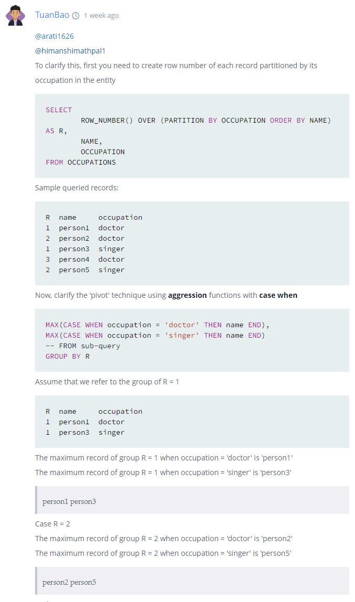

### 삼각형인가?

- A + B > C 여야 이등변 삼각형이 가능함

```sql
SELECT IF (A = B AND B = C, "Equilateral", 
           IF ((A = B OR B = C OR A = C) AND A + B > C, "Isosceles", 
              IF (A + B > C, "Scalene", "Not A Triangle")))
FROM TRIANGLES
```


### THE PADS

- 직업(OCCUPATIONS)에 따라 이름을 알파벳 순으로 정렬한다.
  - 직업은 A(Actor), D(Doctor), P(Professor), S(Singer) 가 있다.
- 직업별 사람 수를 오름차순으로 정렬해라. 출력 포맷은 다음과 같다.
  - There are a total of (사람 수) (직업)s.
  - 직업은 다 lowercase로 출력해라. 
  - 만약 사람 수가 같다면, 알파벳 순으로 정렬해라.

- 각 직업 별 최소 2명이 조재한다.


```sql
SELECT CONCAT(name, "(", left(occupation, 1), ")")
FROM occupations
ORDER BY name;

SELECT CONCAT("There are a total of ", info.cnt, " ", info.job, "s.")
FROM (
    SELECT COUNT(name) as cnt, LOWER(occupation) as job
    FROM occupations
    GROUP BY occupation
    ORDER BY cnt, job
) AS info
```


### Occupations

- 열이 (Doctor, Professor, Singer, Actor) 순으로 구성된다.
- 각 직업에 해당하는 이름을 알파벳 순으로 행을 채운다. 더 이상 사람이 없다면 NULL을 채운다.



```sql
SELECT MAX(CASE WHEN OCCUPATION = 'Doctor' THEN NAME END),
       MAX(CASE WHEN OCCUPATION = 'Professor' THEN NAME END),
       MAX(CASE WHEN OCCUPATION = 'Singer' THEN NAME END),
       MAX(CASE WHEN OCCUPATION = 'Actor' THEN NAME END)
FROM (SELECT ROW_NUMBER() OVER 
     (PARTITION BY OCCUPATION ORDER BY NAME) 
      AS R, NAME, OCCUPATION
      FROM OCCUPATIONS) AS O
GROUP BY R;
```

이 쿼리는 데이터베이스의 OCCUPATIONS 테이블에서 각 직업별로 사람들의 이름을 행으로 나열하고자 합니다. 그럼 이 쿼리가 어떻게 작동하는지 단계별로 살펴봅시다.

1. **서브쿼리**:

```sql
sqlCopy codeSELECT ROW_NUMBER() OVER (PARTITION BY OCCUPATION ORDER BY NAME)
AS R, NAME, OCCUPATION
FROM OCCUPATIONS
```

이 서브쿼리는 OCCUPATIONS 테이블의 모든 행을 처리하며, 각 직업별로 이름에 따라 번호를 매기는 작업을 수행합니다.

- `ROW_NUMBER() OVER (PARTITION BY OCCUPATION ORDER BY NAME) AS R`: 직업(OCCUPATION)으로 그룹을 나눈 후 이름(NAME) 순서로 정렬하여 각 직업별로 행 번호를 부여합니다.

1. **CASE 문**:

```sql
MAX(CASE WHEN OCCUPATION = 'Doctor' THEN NAME END)
```

이 구문은 OCCUPATION 필드의 값이 'Doctor'일 경우 해당 NAME 값을 반환합니다. 다른 직업에 대해서도 유사한 CASE 문이 존재합니다. 이렇게 함으로써 각 직업에 대한 이름 값을 열(column)에 배치할 수 있게 됩니다.

1. **GROUP BY**:

```SQL
GROUP BY R
```

서브쿼리에서 생성된 R(행 번호)을 기준으로 그룹화합니다. 이렇게 하면 각 직업별로 첫 번째 이름, 두 번째 이름, 세 번째 이름 등을 행(row)으로 정렬하게 됩니다.

1. **결과적으로**: 결과 테이블의 각 열(column)은 각각의 직업을 나타내며, 행(row)은 해당 직업의 사람들의 이름을 알파벳 순서대로 나타냅니다. 이름이 없는 경우 NULL 값이 반환됩니다.

즉, 결과 테이블은 다음과 같은 형태가 될 것입니다:

| Doctor | Professor | Singer | Actor |
| ------ | --------- | ------ | ----- |
| Name1  | Name1     | Name1  | Name1 |
| Name2  | Name2     | NULL   | Name2 |
| ...    | ...       | ...    | ...   |

이 쿼리를 사용하면 OCCUPATIONS 테이블의 데이터를 직업별로 정렬하여 알아보기 쉬운 형태로 변환할 수 있습니다.
