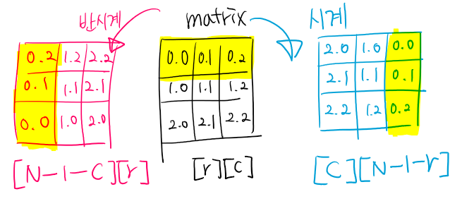
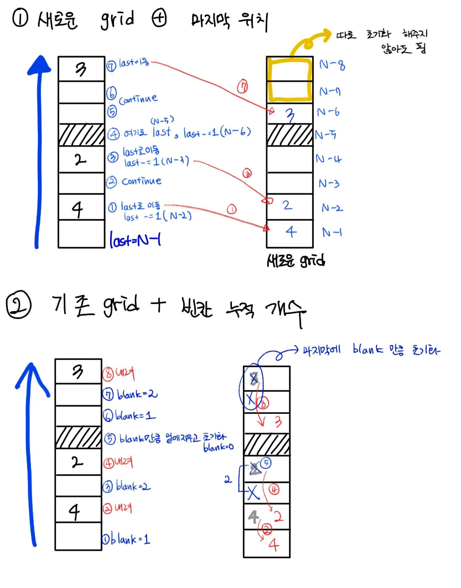

[TOC]

# 시계/반시계 회전



## 시계 90º 

```python
# 원본[r][c] 이라면 '행'을 조작한다.
# 원본의 r, c를 회전하면 최종 목적지는 c, N-r-1이 된다.
rotated[c][N-r-1] = original[r][c]

# 회전[r][c] 이라면 '열'을 조작한다.
# 최종 목적지 r, c는 각각 원본의 N-c-1, r에 해당한다.
rotated[r][c] = original[N-c-1][r]

# zip과 *(언패킹)을 활용
rotated = list(map(list, zip(*original[::-1])))
# original[::-1] 로 위아래를 뒤집는다.
# *original[::-1]은 2행,1행, 0행을 언패킹 한다.
# zip으로 각 행의 열끼리 묶는다.
# 다시 리스트로 변환한다.
```


## 반시계 90º

```python
# 원본[r][c] 이라면 '열'을 조작한다.
rotated[N-c-1][r] = original[r][c]

# 회전[r][c] 이라면 '행'을 조작한다.
rotated[r][c] = original[c][N-r-1]

# zip과 *(언패킹)을 활용
rotated = list(map(list, zip(*original)))[::-1]
# 같은 열끼리 묶어서 행으로 만들고, 위아래를 뒤집는다.
```


### zip에 *(언패킹)을 해야하는 이유

`zip(grid)`는 사실상 `zip([[1, 2, 3], [4, 5, 6], [7, 8, 9]])`와 동일합니다. 이렇게 되면 `grid`의 각 "행"이 하나의 항목으로 취급됩니다. 따라서 결과는 `([1, 2, 3],)`, `([4, 5, 6],)`, `([7, 8, 9],)`와 같이 될 것입니다. 하지만 이것은 우리가 원하는 결과가 아닙니다.

그렇다면 `zip(*grid)`는 어떻게 될까요?

`*grid`를 사용하면 `grid`의 각 "행"이 개별적으로 반환되므로, `zip(*grid)`는 `zip([1, 2, 3], [4, 5, 6], [7, 8, 9])`와 동일하게 동작하게 됩니다. 이렇게 되면 `zip`은 각 리스트의 동일한 인덱스끼리 요소를 묶어줄 것이고, 우리가 원하는 결과 `(1, 4, 7)`, `(2, 5, 8)`, `(3, 6, 9)`를 얻을 수 있습니다.

결론적으로, `*` 연산자는 `zip` 함수에 2차원 리스트의 각 "행"을 개별적인 인자로 전달하기 위해 사용됩니다. 이를 통해 `zip`은 각 "행"의 동일한 인덱스에 있는 요소들을 묶어줄 수 있게 됩니다.


# grid를 넘어가는 왕복

## %= (R-1)*2

```python
r, c, speed = rabbit

for dx, dy in ((1,0),(0,1),(-1,0),(0,-1)):
    nx, ny = (r + speed * dx) % (2 * (R-1)), (c + speed * dy) % (2 * (C-1))
    if nx >= R:
        nx = 2*(R-1)-nx
	if ny >= C:
        ny = 2*(C-1)-ny
```

### `2*(R-1) - nx`의 의미 

```
(R-1) - (nx - (R-1))
=> (R-1) - nx + (R-1)
=> 2*(R-1) - nx
```


## %= (R-1)

```python
r, c, speed, d = shark
nr, nc = r + dr[d] * speed, c + dc[d] * speed

if nr < 0 or nr >= R:
    q = nr // (R - 1) # 홀수 => 반대 방향(반만 왕복), 짝수 => 같은 방향(전체 왕복)
    nr %= (R - 1)
    # nr이 음수이면 (R-1)에서 왼쪽으로 얼마나 움직인 값인지 알 수 있다.
    # nr이 R 이상이면 0에서 오른쪽으로 얼마나 움직인 값인지 알 수 있다.
    
    if (nr // (R-1)) % 2 == 1:
        # 만약 홀수번이라면 반대 방향으로 진행하고 있던 것이다.
        # 반대 방향으로 진행하고 있었다면 위에서 움직인 값을 다시 반대로 빼줘야한다.
        nr = R-1-nr
        d += (-1) ** d

if nc < 0 or nc >= C:
    q = nc // (C - 1)
    nc %= (C-1)
    if q % 2 == 1:
        nc = C - 1 - nc
        d += (-1) ** d
```


# 모두 상하좌우 or 모두 대각선 VS 합쳐진거 판단

- [코드트리 원자 충돌]()
- 한 위치에 2개 이상의 원자가 있으면 합친다. 이때 합쳐지는 원자의 수는 홀수, 짝수가 안정해져있는데
- 멋대로 짝수라고 판단하고 모든 원자의 방향의 합이 짝수이면 All 상하좌우 or 대각선 , 홀수이면 섞인 거라고 생각해서 틀렸다.
- 상하좌우와 대각선의 방향을 각각 세고 전체 원자의 수와 비교해야한다.

```python
# 상하좌우 / 대각선
even, odd = 0, 0

# grid[row][col] 에 [질량, 속도, 방향]을 가진 원자가 여러개 있다.
for m, s, d in grid[row][col]:
    mass += m
    speed += s
    # 방향 계산에서 착각함. 합쳐지는 원소의 수는 짝수, 홀수가 정해지지 않았음
    # 그런데 합쳐지는 원소가 짝수일거라고 멋대로 생각하고,
    # 방향의 합이 짝이면 모두 상하좌우 or 대각선, 홀이면 섞인 것이라고 판단함.
    if d % 2 == 0:
        even += 1
    else:
        odd += 1

# 기존의 원자들 삭제
grid[row][col] = []

# b. 이후 합쳐진 원자는 4개의 원자로 나눠집니다.
# c. 나누어진 원자들은 모두 해당 칸에 위치하고 질량과 속력, 방향은 기준을 따라 결정됩니다.
mass //= 5
if mass == 0:
    # d. 질량이 0인 원소는 소멸됩니다.
    continue
speed //= cnt

if odd == cnt or even == cnt:
    # 모두 상하좌우 or 모두 대각선. 상하좌우 저장
    for d in range(4):
        grid[row][col].append([mass, speed, d*2])
else:
    # 상하좌우랑 대각선이 섞였다. 대각선 4방향을 저장
    for d in range(4):
        grid[row][col].append([mass, speed, d*2+1])
```


# 중간에 방해물이 있는 중력 적용



## 1) 옮길 새로운 그리드 + 마지막 위치 기록

```python
def gravity() -> None:
    moved = [[0] * N for _ in range(N)]

    # 열 -> 행 순으로 돌면서
    for c in range(N):
        # 마지막으로 쌓인 위치를 기록한다.
        last_idx = N-1
        for r in range(N - 1, -1, -1):
            # 돌은 특이한 성질을 띄고 있기 때문에 중력이 작용하더라도 떨어지지 않습니다.
            if grid[r][c] == -1:
                last_idx = r
            if grid[r][c] == 0:
                continue
            moved[last_idx][c] = grid[r][c]
            last_idx -= 1

    # 다시 복사
    for r in range(N):
        grid[r] = moved[r][:]
```

> 새로 초기화한 배열에 복붙하는거라 아래와 달리 따로 남은 빈칸 수 만큼 0으로 바꾸지 않아도 된다.


## 2) 기존 그리드 사용 + 빈칸 개수 누적 및 초기화

```python
def gravity() -> None:
    for col in range(N):
        blank = 0
        # 바닥에서부터 빈칸이 몇개 누적인지 센다.
        # 색깔 폭탄이면 빈칸 개수만큼 내린다.
        # 돌을 만나면 빈칸 개수를 초기화하고, 개수만큼 0으로 돌 밑부터 초기화한다.
        for row in range(N - 1, -1, -1):
            if grid[row][col] == BLACK:
                for blank_row in range(1, blank+1):
                    grid[row+blank_row][col] = 0
                blank = 0
            elif grid[row][col] == 0:
                blank += 1
            else:
                grid[row + blank][col] = grid[row][col]

        # 빈칸이 남았다면 위에서부터 지운다.
        for blank_row in range(blank):
            grid[blank_row][col] = 0
```


# 나선형(달팽이) 이동하기

## 내가 맨날 써먹는 수법

```python
row, col, drt, dist = N // 2, N // 2, 0, 1

while True:
    for _ in range(2):
        for _ in range(dist):
            row += dr[drt]
            col += dc[drt]
            sweep(row, col, drt)
            if row == 0 and col == 0:
                return
            drt = (drt + 1) % 4
        dist += 1
```


