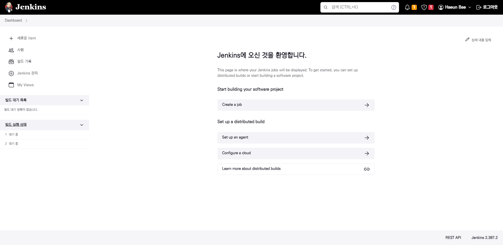

# Jenkins 설치

1. Java 설치해야함
2. Jenkins 설치

# 내 컴으로 접속

1. `sudo ufw allow 내컴퓨터사설아이피` 로 접근 허락
2. 그리고 노트북 사설 아이피로 접근했더니, 플러그인 설치가 안됨(엄청 느림)
3. 이유를 모르겠어서 혹시나 하고 공유기 외부 아이피로 접속했더니 됨
   1. 아마 되돌아오는 길을 못 찾은 듯 하다.
   2. 

