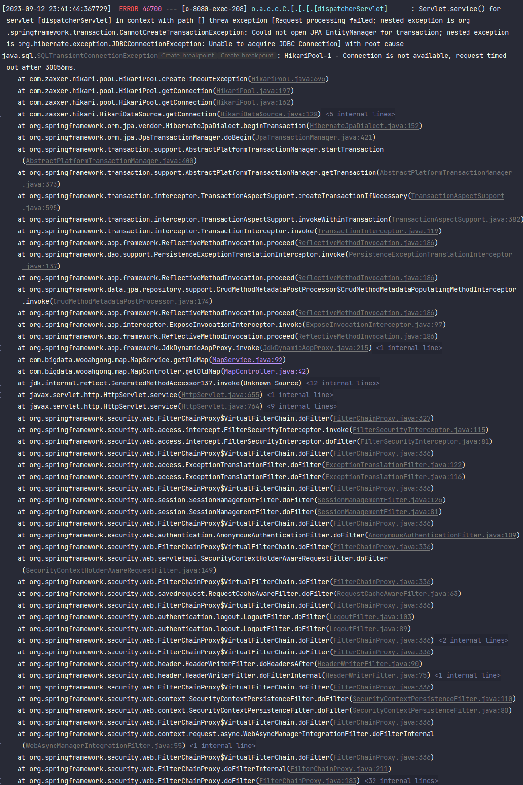

```
[2023-09-12 23:41:44:367729]  ERROR 46700 --- [o-8080-exec-208] o.a.c.c.C.[.[.[.[dispatcherServlet]      : Servlet.service() for servlet [dispatcherServlet] in context with path [] threw exception [Request processing failed; nested exception is org.springframework.transaction.CannotCreateTransactionException: Could not open JPA EntityManager for transaction; nested exception is org.hibernate.exception.JDBCConnectionException: Unable to acquire JDBC Connection] with root cause
java.sql.SQLTransientConnectionException: HikariPool-1 - Connection is not available, request timed out after 30056ms.
	at com.zaxxer.hikari.pool.HikariPool.createTimeoutException(HikariPool.java:696)
	at com.zaxxer.hikari.pool.HikariPool.getConnection(HikariPool.java:197)
	at com.zaxxer.hikari.pool.HikariPool.getConnection(HikariPool.java:162)
	at com.zaxxer.hikari.HikariDataSource.getConnection(HikariDataSource.java:128)
	at org.hibernate.engine.jdbc.connections.internal.DatasourceConnectionProviderImpl.getConnection(DatasourceConnectionProviderImpl.java:122)
	at org.hibernate.internal.NonContextualJdbcConnectionAccess.obtainConnection(NonContextualJdbcConnectionAccess.java:38)
	at org.hibernate.resource.jdbc.internal.LogicalConnectionManagedImpl.acquireConnectionIfNeeded(LogicalConnectionManagedImpl.java:108)
	at org.hibernate.resource.jdbc.internal.LogicalConnectionManagedImpl.getPhysicalConnection(LogicalConnectionManagedImpl.java:138)
	at org.hibernate.internal.SessionImpl.connection(SessionImpl.java:520)
	at org.springframework.orm.jpa.vendor.HibernateJpaDialect.beginTransaction(HibernateJpaDialect.java:152)
	at org.springframework.orm.jpa.JpaTransactionManager.doBegin(JpaTransactionManager.java:421)
	at org.springframework.transaction.support.AbstractPlatformTransactionManager.startTransaction(AbstractPlatformTransactionManager.java:400)
	at org.springframework.transaction.support.AbstractPlatformTransactionManager.getTransaction(AbstractPlatformTransactionManager.java:373)
	at org.springframework.transaction.interceptor.TransactionAspectSupport.createTransactionIfNecessary(TransactionAspectSupport.java:595)
	at org.springframework.transaction.interceptor.TransactionAspectSupport.invokeWithinTransaction(TransactionAspectSupport.java:382)
	at org.springframework.transaction.interceptor.TransactionInterceptor.invoke(TransactionInterceptor.java:119)
	at org.springframework.aop.framework.ReflectiveMethodInvocation.proceed(ReflectiveMethodInvocation.java:186)
	at org.springframework.dao.support.PersistenceExceptionTranslationInterceptor.invoke(PersistenceExceptionTranslationInterceptor.java:137)
	at org.springframework.aop.framework.ReflectiveMethodInvocation.proceed(ReflectiveMethodInvocation.java:186)
	at org.springframework.data.jpa.repository.support.CrudMethodMetadataPostProcessor$CrudMethodMetadataPopulatingMethodInterceptor.invoke(CrudMethodMetadataPostProcessor.java:174)
	at org.springframework.aop.framework.ReflectiveMethodInvocation.proceed(ReflectiveMethodInvocation.java:186)
	at org.springframework.aop.interceptor.ExposeInvocationInterceptor.invoke(ExposeInvocationInterceptor.java:97)
	at org.springframework.aop.framework.ReflectiveMethodInvocation.proceed(ReflectiveMethodInvocation.java:186)
	at org.springframework.aop.framework.JdkDynamicAopProxy.invoke(JdkDynamicAopProxy.java:215)
	at com.sun.proxy.$Proxy161.findAll(Unknown Source)
	at com.bigdata.wooahgong.map.MapService.getOldMap(MapService.java:92)
	at com.bigdata.wooahgong.map.MapController.getOldMap(MapController.java:42)
	at jdk.internal.reflect.GeneratedMethodAccessor137.invoke(Unknown Source)
	at java.base/jdk.internal.reflect.DelegatingMethodAccessorImpl.invoke(DelegatingMethodAccessorImpl.java:43)
	at java.base/java.lang.reflect.Method.invoke(Method.java:566)
	at org.springframework.web.method.support.InvocableHandlerMethod.doInvoke(InvocableHandlerMethod.java:205)
	at org.springframework.web.method.support.InvocableHandlerMethod.invokeForRequest(InvocableHandlerMethod.java:150)
	at org.springframework.web.servlet.mvc.method.annotation.ServletInvocableHandlerMethod.invokeAndHandle(ServletInvocableHandlerMethod.java:117)
	at org.springframework.web.servlet.mvc.method.annotation.RequestMappingHandlerAdapter.invokeHandlerMethod(RequestMappingHandlerAdapter.java:895)
	at org.springframework.web.servlet.mvc.method.annotation.RequestMappingHandlerAdapter.handleInternal(RequestMappingHandlerAdapter.java:808)
	at org.springframework.web.servlet.mvc.method.AbstractHandlerMethodAdapter.handle(AbstractHandlerMethodAdapter.java:87)
	at org.springframework.web.servlet.DispatcherServlet.doDispatch(DispatcherServlet.java:1067)
	at org.springframework.web.servlet.DispatcherServlet.doService(DispatcherServlet.java:963)
	at org.springframework.web.servlet.FrameworkServlet.processRequest(FrameworkServlet.java:1006)
	at org.springframework.web.servlet.FrameworkServlet.doGet(FrameworkServlet.java:898)
	at javax.servlet.http.HttpServlet.service(HttpServlet.java:655)
	at org.springframework.web.servlet.FrameworkServlet.service(FrameworkServlet.java:883)
	at javax.servlet.http.HttpServlet.service(HttpServlet.java:764)
	at org.apache.catalina.core.ApplicationFilterChain.internalDoFilter(ApplicationFilterChain.java:227)
	at org.apache.catalina.core.ApplicationFilterChain.doFilter(ApplicationFilterChain.java:162)
	at org.apache.tomcat.websocket.server.WsFilter.doFilter(WsFilter.java:53)
	at org.apache.catalina.core.ApplicationFilterChain.internalDoFilter(ApplicationFilterChain.java:189)
	at org.apache.catalina.core.ApplicationFilterChain.doFilter(ApplicationFilterChain.java:162)
	at org.springframework.web.filter.AbstractRequestLoggingFilter.doFilterInternal(AbstractRequestLoggingFilter.java:289)
	at org.springframework.web.filter.OncePerRequestFilter.doFilter(OncePerRequestFilter.java:117)
	at org.apache.catalina.core.ApplicationFilterChain.internalDoFilter(ApplicationFilterChain.java:189)
	at org.apache.catalina.core.ApplicationFilterChain.doFilter(ApplicationFilterChain.java:162)
	at org.springframework.security.web.FilterChainProxy$VirtualFilterChain.doFilter(FilterChainProxy.java:327)
	at org.springframework.security.web.access.intercept.FilterSecurityInterceptor.invoke(FilterSecurityInterceptor.java:115)
	at org.springframework.security.web.access.intercept.FilterSecurityInterceptor.doFilter(FilterSecurityInterceptor.java:81)
	at org.springframework.security.web.FilterChainProxy$VirtualFilterChain.doFilter(FilterChainProxy.java:336)
	at org.springframework.security.web.access.ExceptionTranslationFilter.doFilter(ExceptionTranslationFilter.java:122)
	at org.springframework.security.web.access.ExceptionTranslationFilter.doFilter(ExceptionTranslationFilter.java:116)
	at org.springframework.security.web.FilterChainProxy$VirtualFilterChain.doFilter(FilterChainProxy.java:336)
	at org.springframework.security.web.session.SessionManagementFilter.doFilter(SessionManagementFilter.java:126)
	at org.springframework.security.web.session.SessionManagementFilter.doFilter(SessionManagementFilter.java:81)
	at org.springframework.security.web.FilterChainProxy$VirtualFilterChain.doFilter(FilterChainProxy.java:336)
	at org.springframework.security.web.authentication.AnonymousAuthenticationFilter.doFilter(AnonymousAuthenticationFilter.java:109)
	at org.springframework.security.web.FilterChainProxy$VirtualFilterChain.doFilter(FilterChainProxy.java:336)
	at org.springframework.security.web.servletapi.SecurityContextHolderAwareRequestFilter.doFilter(SecurityContextHolderAwareRequestFilter.java:149)
	at org.springframework.security.web.FilterChainProxy$VirtualFilterChain.doFilter(FilterChainProxy.java:336)
	at org.springframework.security.web.savedrequest.RequestCacheAwareFilter.doFilter(RequestCacheAwareFilter.java:63)
	at org.springframework.security.web.FilterChainProxy$VirtualFilterChain.doFilter(FilterChainProxy.java:336)
	at org.springframework.security.web.authentication.logout.LogoutFilter.doFilter(LogoutFilter.java:103)
	at org.springframework.security.web.authentication.logout.LogoutFilter.doFilter(LogoutFilter.java:89)
	at org.springframework.security.web.FilterChainProxy$VirtualFilterChain.doFilter(FilterChainProxy.java:336)
	at org.springframework.web.filter.CorsFilter.doFilterInternal(CorsFilter.java:91)
	at org.springframework.web.filter.OncePerRequestFilter.doFilter(OncePerRequestFilter.java:117)
	at org.springframework.security.web.FilterChainProxy$VirtualFilterChain.doFilter(FilterChainProxy.java:336)
	at org.springframework.security.web.header.HeaderWriterFilter.doHeadersAfter(HeaderWriterFilter.java:90)
	at org.springframework.security.web.header.HeaderWriterFilter.doFilterInternal(HeaderWriterFilter.java:75)
	at org.springframework.web.filter.OncePerRequestFilter.doFilter(OncePerRequestFilter.java:117)
	at org.springframework.security.web.FilterChainProxy$VirtualFilterChain.doFilter(FilterChainProxy.java:336)
	at org.springframework.security.web.context.SecurityContextPersistenceFilter.doFilter(SecurityContextPersistenceFilter.java:110)
	at org.springframework.security.web.context.SecurityContextPersistenceFilter.doFilter(SecurityContextPersistenceFilter.java:80)
	at org.springframework.security.web.FilterChainProxy$VirtualFilterChain.doFilter(FilterChainProxy.java:336)
	at org.springframework.security.web.context.request.async.WebAsyncManagerIntegrationFilter.doFilterInternal(WebAsyncManagerIntegrationFilter.java:55)
	at org.springframework.web.filter.OncePerRequestFilter.doFilter(OncePerRequestFilter.java:117)
	at org.springframework.security.web.FilterChainProxy$VirtualFilterChain.doFilter(FilterChainProxy.java:336)
	at org.springframework.security.web.FilterChainProxy.doFilterInternal(FilterChainProxy.java:211)
	at org.springframework.security.web.FilterChainProxy.doFilter(FilterChainProxy.java:183)
	at org.springframework.web.filter.DelegatingFilterProxy.invokeDelegate(DelegatingFilterProxy.java:354)
	at org.springframework.web.filter.DelegatingFilterProxy.doFilter(DelegatingFilterProxy.java:267)
	at org.apache.catalina.core.ApplicationFilterChain.internalDoFilter(ApplicationFilterChain.java:189)
	at org.apache.catalina.core.ApplicationFilterChain.doFilter(ApplicationFilterChain.java:162)
	at org.springframework.web.filter.RequestContextFilter.doFilterInternal(RequestContextFilter.java:100)
	at org.springframework.web.filter.OncePerRequestFilter.doFilter(OncePerRequestFilter.java:117)
	at org.apache.catalina.core.ApplicationFilterChain.internalDoFilter(ApplicationFilterChain.java:189)
	at org.apache.catalina.core.ApplicationFilterChain.doFilter(ApplicationFilterChain.java:162)
	at org.springframework.web.filter.FormContentFilter.doFilterInternal(FormContentFilter.java:93)
	at org.springframework.web.filter.OncePerRequestFilter.doFilter(OncePerRequestFilter.java:117)
	at org.apache.catalina.core.ApplicationFilterChain.internalDoFilter(ApplicationFilterChain.java:189)
	at org.apache.catalina.core.ApplicationFilterChain.doFilter(ApplicationFilterChain.java:162)
	at org.springframework.web.filter.CharacterEncodingFilter.doFilterInternal(CharacterEncodingFilter.java:201)
	at org.springframework.web.filter.OncePerRequestFilter.doFilter(OncePerRequestFilter.java:117)
	at org.apache.catalina.core.ApplicationFilterChain.internalDoFilter(ApplicationFilterChain.java:189)
	at org.apache.catalina.core.ApplicationFilterChain.doFilter(ApplicationFilterChain.java:162)
	at org.apache.catalina.core.StandardWrapperValve.invoke(StandardWrapperValve.java:197)
	at org.apache.catalina.core.StandardContextValve.invoke(StandardContextValve.java:97)
	at org.apache.catalina.authenticator.AuthenticatorBase.invoke(AuthenticatorBase.java:540)
	at org.apache.catalina.core.StandardHostValve.invoke(StandardHostValve.java:135)
	at org.apache.catalina.valves.ErrorReportValve.invoke(ErrorReportValve.java:92)
	at org.apache.catalina.core.StandardEngineValve.invoke(StandardEngineValve.java:78)
	at org.apache.catalina.connector.CoyoteAdapter.service(CoyoteAdapter.java:357)
	at org.apache.coyote.http11.Http11Processor.service(Http11Processor.java:382)
	at org.apache.coyote.AbstractProcessorLight.process(AbstractProcessorLight.java:65)
	at org.apache.coyote.AbstractProtocol$ConnectionHandler.process(AbstractProtocol.java:895)
	at org.apache.tomcat.util.net.NioEndpoint$SocketProcessor.doRun(NioEndpoint.java:1732)
	at org.apache.tomcat.util.net.SocketProcessorBase.run(SocketProcessorBase.java:49)
	at org.apache.tomcat.util.threads.ThreadPoolExecutor.runWorker(ThreadPoolExecutor.java:1191)
	at org.apache.tomcat.util.threads.ThreadPoolExecutor$Worker.run(ThreadPoolExecutor.java:659)
	at org.apache.tomcat.util.threads.TaskThread$WrappingRunnable.run(TaskThread.java:61)
	at java.base/java.lang.Thread.run(Thread.java:834)
```




Servlet.service() for servlet [dispatcherServlet] in context with path [] threw exception [Request processing failed; nested exception is 

org.springframework.transaction.CannotCreateTransactionException: 

Could not open JPA EntityManager for transaction; 

nested exception is 

org.hibernate.exception.JDBCConnectionException: 

Unable to acquire JDBC Connection] with root cause
java.sql.SQLTransientConnectionException: 

HikariPool-1 - Connection is not available, request timed out after 30056ms.


이 에러는 HikariCP(데이터베이스 커넥션 풀 라이브러리)에서 JDBC 커넥션을 획득하지 못했을 때 발생합니다. 지정된 시간(여기서는 30056ms) 동안 사용 가능한 커넥션을 획득하지 못한 것을 나타냅니다.

원인:
1. **데이터베이스 부하**: 너무 많은 요청이 데이터베이스로 전달되면 커넥션 풀의 모든 커넥션이 사용 중일 수 있습니다. 
2. **커넥션 풀 크기 설정**: HikariCP의 설정에서 최대 커넥션 수(maximumPoolSize)가 너무 작게 설정되어 있을 수 있습니다.
3. **DB 서버 이슈**: 데이터베이스 서버의 성능 문제, 네트워크 문제 또는 다른 외부 요인으로 인해 커넥션을 맺는데 문제가 발생할 수 있습니다.
4. **장기 실행 쿼리**: 일부 쿼리가 너무 오래 실행되면 다른 요청들이 커넥션을 기다리는 동안 타임아웃될 수 있습니다.

해결 방법:
1. **커넥션 풀 크기 조정**: `application.properties` 또는 `application.yml` 파일에서 HikariCP 설정을 찾아 `maximumPoolSize` 값을 증가시켜보세요.
2. **데이터베이스 모니터링**: 데이터베이스의 성능 문제를 파악하기 위해 모니터링 도구를 사용하여 현재 상황을 확인하고 필요한 조치를 취하세요.
3. **쿼리 최적화**: 느린 쿼리가 있는지 확인하고, 필요한 경우 쿼리를 최적화하거나 인덱싱을 고려하세요.
4. **HikariCP 설정**: HikariCP의 타임아웃 설정인 `connectionTimeout` 값을 조절하여 더 긴 시간 동안 커넥션을 기다리도록 설정할 수 있습니다. 그러나 이는 문제의 근본적인 원인을 해결하는 것이 아니므로 임시 해결책으로만 사용해야 합니다.
5. **DB 연결 확인**: 데이터베이스 서버의 연결 상태 및 설정을 확인하십시오. 필요한 경우 DB 관리자나 팀과 협력하여 문제를 해결하십시오.

다양한 원인과 해결 방법이 있으므로, 상황에 따라 적절한 조치를 선택하는 것이 중요합니다.