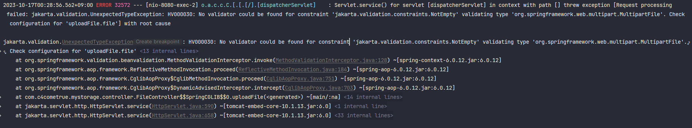
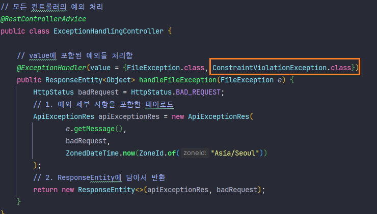

# 유효성 검사하기

`@Validated` 는 클래스에 붙이는 어노테이션으로, 클래스 안의 메서드들의 파라미터를 검증하라고 지시하는 것이다. (메서드에 붙이지 마라)

`@Valid` 는 메서드 파라미터에 붙이는 어노테이션으로, 메서드들의 파라미터를 검증하라고 지시하는 것이다.

## 1. Request Body 검사하기

Request DTO에 각 필드에 조건을 설정한다.

```java
public class RequestDTO {
    @NotBlank
    private final String message;
}
```

- NotNull : Null이면 안된다.
- NotEmpty : 비어있으면 안된다.
- NotBlank : 문자열이 최소한 1글자 이상이어야 한다.
- Min, Max : 최소, 최대값
- Pattern : 정규표현식
- Email : 이메일 형태여야 한다.


Controller의 RequestBody 앞에 `@Valid` 어노테이션을 붙인다.

```java
class Controller {
    public void api (@Valid @RequestBody RequestDto requestDto) {
        // 로직
    }
}
```

만약 검증에 실패하면 `MethodArgumentNotValidException` 예외가 발생하고, Bad Request 응답을 반환하게 된다.


## 2. Request Parameter, Path Variable 검사하기

이 경우에는 해당 파라미터 앞에 바로 조건을 설정한다.

```java
@Validated
@RestController
class Controller {
    @GetMapping("/{id}")
    void api(@PathVariable("id") @Min(5) int id) {
        //
    }
    
    @GetMapping("/")
    void api(@RequestParam("id") @Min(5) int id) {
        //
    }
}
```

클래스에 `@Validated` 를 붙이는 것을 잊지 말자. 이 경우엔 실패하면 `ConstraintViolationException` 예외가 발생하고 이 예외에 대한 처리가 스프링엔 기본적으로 되어있지 않기 때문에 500 에러가 발생한다. 따라서 추가적으로 이 예외를 처리할 수 있는 CustomException을 만들어줘야 한다.




연결된 Validator가 없다며 500에러를 뿜어버리는 모습



https://reflectoring.io/bean-validation-with-spring-boot/#validating-a-request-body


## @Validated와 @Valid 구분

우선 둘다 `Bean Validation 구현체 (Hibernate Validator)` 가 실제로 일을 한다. 대신 Valid는 Java(JSR 380) 규칙을 따르고, Validated는 Spring에서 제공하는 유효성 검사 규칙을 따른다. 

Valid는 주로 객체의 필드, 그 객체 내부의 다른 객체들의 유효성을 검사할 때 사용된다. 위에 적었든 메서드 파라미터 앞에 붙인다. `MethodArgumentValidException` 을 발생시킨다.

Validated는 클래스에 붙이는 어노테이션이고, 검사 규칙을 그룹화 할 수 있다. (인터페이스로 유효성 검사를 다르게 적용할 그룹들을 만들고, 그 인터페이스를 구현한 클래스에 다른 유효성 규칙을 적용할 수 있음)  

서비스 레이어 단에서 발생하는 예외는 `ConstraintViolationException` 이다. **5xx 응답** 을 내보낸다. 

컨트롤러단의 Parameter `@RequestBody` 에서 발생하는 예외는 `MethodArgumentnotValidException` 이다. **4xx 응답** 을 내보낸다.

다음 예제로 실제 적용 환경을 구분해보자

User 클래스에 여러 필드가 있고, 각자 적절한 유효성 검사 조건이 할당되어있다고 치자.

- 컨트롤러에 Validated 없음 + 각자 파라미터에 조건이 달려있음

```java
@Controller
public class ApiController {
    public ResponseEntity<> apiService(@NotBlank String name, @Valid User user) {
        // ...
    }
}
```

=> name은 유효성 요청은 하겠지만 Validated가 없기 때문에 유효성 검사가 실행되진 않는다. User에는 Valid가 붙어있기 때문에 Bean Validation이 적용되고, 유효성 검사에 실패하면  `MethodArgumentNotValidException`이 발생하며, 일반적으로 클라이언트에 400 Bad Request 응답이 전송된다.

만약 name에 Valid를 단다면, 유효성 검증이 되지 않는다. 왜냐면 Valid는 객체 내부의 필드와 구조를 재귀적으로 검사하는데, 기본 타입은 그러한 내부 구조나 필드가 없다. 따라서 유효성이 검증되지 않고, Validated가 필요하다.

- 컨트롤러에 Validated 있음 + 각자 파라미터에 조건이 있음

```java
@Controller
@Validated
public class ApiController {
    public ResponseEntity<> apiService(@NotBlank String name, @Valid User user) {
        // ...
    }
}
```

`@Validated`가 컨트롤러에 있고, 복합 객체 파라미터에 `@Valid`가 붙어있을 경우에도 실제 복합 객체의 유효성 검사는 Bean Validation 구현체 (예: Hibernate Validator)에 의해 수행됩니다.

그러나 어노테이션의 존재 여부와 위치에 따라 검사의 컨텍스트와 범위가 달라질 수 있습니다.

1. **@Validated (컨트롤러 레벨)**: 컨트롤러 레벨에서 사용될 때 주로 그룹화된 유효성 검사를 위한 것입니다. 만약 특정 그룹에 속한 유효성 규칙만 검사하고 싶다면, `@Validated`와 함께 그룹을 지정할 수 있습니다. 그러나 메서드 파라미터의 복합 객체 검사를 활성화하는 것은 아닙니다.
2. **@Valid (메서드 파라미터 레벨)**: 복합 객체의 유효성 검사를 활성화합니다. 해당 객체와, 객체 내부의 다른 객체나 컬렉션에 대한 유효성 검사 규칙을 적용합니다.

따라서, `@Validated`가 컨트롤러에 있더라도 복합 객체 파라미터의 유효성 검사를 활성화하려면 해당 파라미터 앞에 `@Valid`가 필요합니다. `@Valid`에 의해 파라미터의 유효성 검사가 활성화되고, 내부적으로는 Bean Validation 구현체에 의해 검사가 수행됩니다.

- 컨트롤러에 Validated 있음 + 복합 객체에 Valid가 없음

```java
@Controller
@Validated
public class ApiController {
    public ResponseEntity<> apiService(@NotBlank String name, User user) {
        // ...
    }
}
```

컨트롤러에 `@Validated`가 있고, `User` 클래스의 필드들에 유효성 검사 조건(예: `@NotBlank`, `@NotNull` 등)이 적용되어 있지만, 컨트롤러 메서드에서 `User` 파라미터 앞에 `@Valid`를 붙이지 않았다면, 해당 `User` 파라미터에 대한 유효성 검사는 수행되지 않습니다.


# Exception

- ServiceException이라는 모체 예외
  - errCode
  - errMessage
  - debugMessage
- ErrorCode
  - httpStatus
  - message
  - NOT FOUND : `NOT_EXIST_FILE`, `NOT_EXIST_USER` ...
  - `NO_PERMISSION`
- 디버그 메세지를 만들고 이를 서버 관리자만 볼 수 있도록...
- throw ErrorCode.이넘값.serviceException("메세지...")