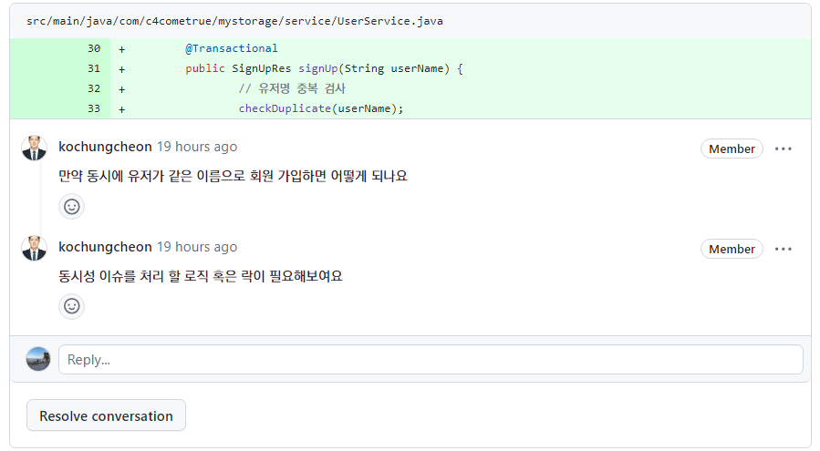
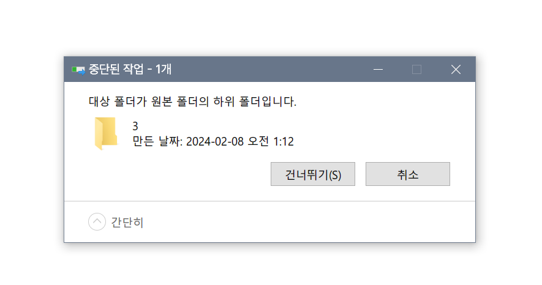
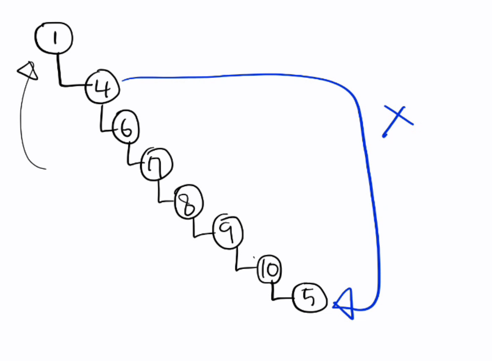
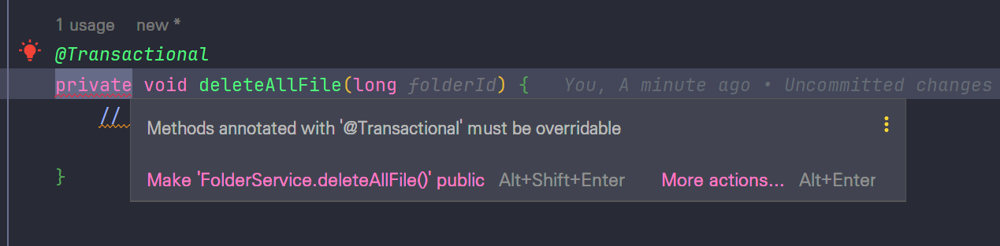

# Step1

## FileController

### :ballot_box_with_check: 파일 다운로드는 `GET`

POST로 파일명과 사용자명을 받을까 하다가... 구글 다운로드 링크를 참고했더니 GET이었다.

```
https://drive.usercontent.google.com/download?
id=어떤 값
&export=download
&authuser=0
&confirm=t
&uuid=어떤 값
&at=어떤 값:1697175226878
```


## FileService

### :ballot_box_with_check: IOException

파일 저장, 삭제, 읽기 때문에 IOException을 처리해야한다.

하지만 코드안에 try-catch(finally가 별로) 문을 써도 괜찮은걸까? 뭔가 별로 좋진 않다고 들었던 기억이...

그리고 파일을 삭제할 때나 다운로드할 때 애초에 파일이 손상되어있으면 안되는건데..

파일이 비어있거나, 사용자가 권한이 없다면 따로 **Custom Exception**을 발동시켜야 할까? (핵심 X)

- finally 안에서 예외 처리를 해야할 수도 있기 때문에, 파일 열고 닫기에서 남용하면 안좋다!

```java
class MyClass {
    static void copy(String src, String dst) throws IOException {
        var in = new FileInputStream(src);
        try {
            var out = new FileOutputStream(dst);
            try {
                // 내부 구현
            } finally {
                out.close();
            }
        } finally {
            // 이런식으로 무지성 finally 쓰면 안좋다!
            in.close();
        }
    }
}
```


### CustomException

- `@RestControllerAdvice` 와 `@ControllerAdvice`의 차이가 뭐지?
- 


### :ballot_box_with_check: 같은 파일 이름

한 사용자가 같은 파일 이름을 올리면 `파일명 (1)` 이런 식으로 보통 저장하는데, 이 로직을 구현해야할까?

- 그렇다면 DB에 원본 파일 이름을 저장해놓고, 그 파일이 몇개인지 세고, 가장 작은 번호 부터 빈칸이 나올 때 까지 반복문을 돌려야하나?

- 메타데이터에 그러면

  1. 파일 원래 이름
  2. 파일 수정된 이름
  3. 실제 디스크에 저장된 파일 이름

  까지 총 3개의 이름을 저장..??

- 중복이 된다면 이름 처리는 앞단에서 하고 서버는 같은 파일 응답?
- 실제 사용성을 고려해보는게 중요 (순서에 따라 영역을 나누자)


### :ballot_box_with_check: downloadFile

파일을 다운로드 할 수 있다면 파일을 포함해서 반환해야하지만, 오류가 발생해서 body에 담을게 없을 경우, 함수의 반환 타입을 어떻게 지정해야 좋을까?

> 에러 상황들은 body 없이 build로 끝내고, `ResponseEntity<Resource> `로 설정함


## 그외

### :ballot_box_with_check: 객체 지향.. Impl로 만들어야하나?

- 모든 것에 대해 추상화와 구현체를 만들어야 할까?

> 필요하다고 느껴지지 않다면 굳이 쓰지 않아도 된다!


- ApiExceptionRes에 message를 포함해야 하는가?


### RequestPart와 RequestParam의 유효성 검사

requestParam에서 값이 없으면 아래 에러가 발생

`org.springframework.web.multipart.support.MissingServletRequestPartException`

---

`MissingServletRequestPartException`과 `ConstraintViolationException`은 서로 다른 상황에서 발생하는 예외입니다.

1. **MissingServletRequestPartException**: 이 예외는 `@RequestPart` 어노테이션을 사용할 때 해당 요청 파트(part)가 전송되지 않았을 경우 발생합니다. 즉, 클라이언트 측에서 해당 요청 파트를 전송하지 않아서 발생한 예외입니다. `username`이 `@RequestPart`로 기대되었지만, 클라이언트에서 해당 파트가 전송되지 않았기 때문에 이 예외가 발생한 것입니다.
2. **ConstraintViolationException**: 이 예외는 Bean Validation (`@Valid`, `@NotBlank`, `@NotNull` 등의 어노테이션)이 적용된 객체의 제약 조건이 위반되었을 때 발생합니다.

따라서, 당신의 경우는 클라이언트가 `username` 파트를 전송하지 않아서 `MissingServletRequestPartException`이 발생한 것입니다. `ConstraintViolationException`은 클라이언트가 `username` 파트를 빈 문자열로 전송했을 때나, 다른 유효성 제약 조건을 위반했을 때 발생할 것입니다.

즉, 두 예외는 다음과 같은 시나리오에서 발생합니다:

- `MissingServletRequestPartException`: 클라이언트가 `username` 파트를 아예 전송하지 않았을 때
- `ConstraintViolationException`: 클라이언트가 `username` 파트를 전송했지만, 제약 조건을 만족시키지 못하는 값을 전송했을 때 (예: 빈 문자열)

## step1 테스트 코드 작성

1. 파일 업로드
   1. 파일도 있고, 이름도 있고 -> O
   2. 파일은 있고, 이름이 없고 -> X
   3. 파일이 없고, 이름이 있고 -> X
   4. 파일도 이름도 없고 -> X
2. 파일 삭제
   1. 파일도 있고, 이름도 있고 -> O
   2. 파일은 있고, 이름이 없고 -> X
   3. 파일이 없고, 이름이 있고 -> X
   4. 파일도 이름도 없고 -> X
3. 파일 다운로드
   1. 파일도 있고, 이름도 있고 -> O
   2. 파일은 있고, 이름이 없고 -> X
   3. 파일이 없고, 이름이 있고 -> X
   4. 파일도 이름도 없고 -> X


# Step2

## 가장 최상위 root 폴더?

- 폴더 안에 폴더가 있을 수 있다. 그렇다면 가장 최상위에 존재하는 폴더는 어떻게??
- 일단 유저별로 폴더를 만들어주고, 그 폴더의 부모폴더 pk를 0으로 설정했다.
- root 폴더가 테이블에 존재해야하는가??
  - 폴더가 제대로 존재하는지 확인하기 위해선 최상위 폴더까지 타고 올라가고 싶은데..
  - 생각해보면 root 폴더는 굳이 DB에 없어도 될 것 같긴 해...

## 폴더가 제대로 존재하는지 확인?

폴더가 제대로 존재하는지 확인하려면 최상위까지 타고 올라가봐야하는데, 모든 로직마다 이걸 확인해줘야한다.

- 여기서 너무 시간 뺏길 것 같아. 그런데 안해주자니 찜찜하고..
- 데이터가 당연히 완전하지 않을 수 있다고 한다고 했지...
- 사실 그냥 폴더를 타고 올라가냐 vs 마냐의 차이인데
  - 타고 올라간다 : 요청이 많으면 폭주할거다.
  - 안탄다 : 폴더가 제대로 존재하지 않으면 어쩔거냐??
    - 이게 큰 문제가 되나?? 존재하는데 어쩔건데... 
- 아 게다가 폴더 소유주도 확인해야되네... ㅡㅡ

## `@NotNull` VS `@Column(nullable=false)` 

|           | NotNull                                                      | Column(nullable=false)                 |
| --------- | ------------------------------------------------------------ | -------------------------------------- |
| 검증 주체 | Bean Validation                                              | Java Persistence API                   |
| 에러      | ***javax.validation.ConstraintViolationException***          | o.h.engine.jdbc.spi.SqlExceptionHelper |
|           | 어플리케이션 레벨에서 검사한다(유효 조건에 안 맞으면 Hibernate가 실행되지도 않음) |                                        |
|           |                                                              |                                        |

요즘엔 Hibernate가 자동으로 `@NotNull`을 인식하고 테이블에 NotNull 설정을 체크해준다.

`spring.jpa.properties.hibernate.check_nullability=true` 를 설정하면 `@Column(nullable=false)`조건을 설정하면 null에 대해 Hibernate가 insert SQL문을 보내지 않는다.

 NotNull이 보통은 좋은데, 왜냐면 Hibernate가 insert 쿼리문을 보내기 전에 막을 수 있기 때문이다. 그리고 Bean Validation에서 수행하는게 좋다. 


https://www.baeldung.com/hibernate-notnull-vs-nullable

https://kafcamus.tistory.com/15

### +) `@NotBlank`

NotNull 은 DDL에 자동으로 넣어주면서, 왜 다른 애들은 해주지 않는거지??

https://kafcamus.tistory.com/15


## 테스트 코드에서 pk...

```java
public CreateFolderRes createFolder(long parentFolderId, String userName, String folderName) {
		// 중복 폴더 존재 확인
		checkDuplicateFolder(parentFolderId, userName, folderName);

		// 부모 폴더를 소유하는지 확인하려면, 결국 이것도 끝까지 타고 올라가야됨.. 하;

		// 폴더 메타 데이터 DB 저장
		FolderMetaData folderMetaData = FolderMetaData.builder()
			.folderName(folderName)
			.userName(userName)
			.parentFolderId(parentFolderId)
			.build();
		// 이거!!!
		folderMetaData = folderRepository.save(folderMetaData);

		return new CreateFolderRes(folderMetaData.getFolderId(), folderName, userName);
	}
```

folderMetaData.getFolderId() 때문에 pk가 필요한데 repository가 mocking된 상태라 pk가 안생겨서 null이 되어서 자꾸 에러 터짐. 그런데 단위 테스트라 H2 연결하기도 애매함. 진짜 머리 터질것 같아서 고민하다가 걍 folderMetaData에 다시 할당함...


## 회원가입 동시성 이슈



흠 이걸보고 검색해본 결과 

- `synchronized` 
- 비관적락/낙관적락 걸기

가 있고, 사실 닉네임 중복 허용하고 사용자 구분을 PK로 해도 되겠다는 생각이 들었다.

그런데 락을 써보고싶긴 한데... 비관적락 썼더니 데드락이 존나 걸림

```java
public interface UserDataRepository extends JpaRepository<UserData, Long> {
	@Lock(LockModeType.PESSIMISTIC_WRITE)
	@Query("select u from UserData u where u.userName =:username")
	Optional<UserData> findByUserNamePessimisticLock(String username);
}

```

```java
package com.c4cometrue.mystorage.service;

import static org.assertj.core.api.Assertions.*;

import java.util.HashSet;
import java.util.concurrent.CountDownLatch;
import java.util.concurrent.ExecutorService;
import java.util.concurrent.Executors;

import org.junit.jupiter.api.AfterEach;
import org.junit.jupiter.api.Test;
import org.springframework.beans.factory.annotation.Autowired;
import org.springframework.boot.test.context.SpringBootTest;

import com.c4cometrue.mystorage.entity.UserData;
import com.c4cometrue.mystorage.repository.UserDataRepository;

import jakarta.transaction.Transactional;

@SpringBootTest
class UserServiceConcurrencyTest {
	@Autowired
	private UserService userService;

	@Autowired
	private UserDataRepository userDataRepository;

	@AfterEach
	void tearDown() {
		userDataRepository.deleteAll();
	}

	@Test
	void same_signup() throws InterruptedException {
		// given
		String[] names = new String[] {"hey", "hee", "what", "you"};

		int threadCount = 10;
		HashSet<Integer> nameGet = new HashSet<>();
		ExecutorService executorService = Executors.newFixedThreadPool(10);
		CountDownLatch latch = new CountDownLatch(threadCount);

		for (int i = 0; i < threadCount; i++) {
			int finalI = i;
			int randomIdx = (int) (Math.random() * 3);
			executorService.submit(() -> {
				try {
					var res = userService.signUp(names[randomIdx]);
					nameGet.add(finalI);
					System.out.println(finalI+"의 이름은 : "+names[randomIdx]);
				} catch (Exception e) {
					System.out.println(e.getMessage());
					System.out.println(finalI + "는 "+ names[randomIdx] +"을 얻을 수 없어");
				} finally {
					latch.countDown();
				}
			});
		}
		latch.await();

		assertThat(nameGet).hasSize(4);
	}
}

```


```
> Task :compileJava
> Task :processResources UP-TO-DATE
> Task :classes
> Task :compileTestJava
> Task :processTestResources NO-SOURCE
> Task :testClasses
18:57:17.534 [Test worker] INFO org.springframework.test.context.support.AnnotationConfigContextLoaderUtils -- Could not detect default configuration classes for test class [com.c4cometrue.mystorage.service.UserServiceConcurrencyTest]: UserServiceConcurrencyTest does not declare any static, non-private, non-final, nested classes annotated with @Configuration.
18:57:17.812 [Test worker] INFO org.springframework.boot.test.context.SpringBootTestContextBootstrapper -- Found @SpringBootConfiguration com.c4cometrue.mystorage.C4CometrueStorageApplication for test class com.c4cometrue.mystorage.service.UserServiceConcurrencyTest

  .   ____          _            __ _ _
 /\\ / ___'_ __ _ _(_)_ __  __ _ \ \ \ \
( ( )\___ | '_ | '_| | '_ \/ _` | \ \ \ \
 \\/  ___)| |_)| | | | | || (_| |  ) ) ) )
  '  |____| .__|_| |_|_| |_\__, | / / / /
 =========|_|==============|___/=/_/_/_/
 :: Spring Boot ::                (v3.1.4)

2023-12-05T18:57:19.051+09:00  INFO 37916 --- [    Test worker] c.c.m.s.UserServiceConcurrencyTest       : Starting UserServiceConcurrencyTest using Java 17.0.8 with PID 37916 (started by pear in C:\Users\pear\study\C4\my-storage)
2023-12-05T18:57:19.053+09:00  INFO 37916 --- [    Test worker] c.c.m.s.UserServiceConcurrencyTest       : The following 1 profile is active: "dev"
2023-12-05T18:57:20.768+09:00  INFO 37916 --- [    Test worker] .s.d.r.c.RepositoryConfigurationDelegate : Bootstrapping Spring Data JPA repositories in DEFAULT mode.
2023-12-05T18:57:20.914+09:00  INFO 37916 --- [    Test worker] .s.d.r.c.RepositoryConfigurationDelegate : Finished Spring Data repository scanning in 126 ms. Found 3 JPA repository interfaces.
2023-12-05T18:57:21.861+09:00  INFO 37916 --- [    Test worker] o.hibernate.jpa.internal.util.LogHelper  : HHH000204: Processing PersistenceUnitInfo [name: default]
2023-12-05T18:57:22.019+09:00  INFO 37916 --- [    Test worker] org.hibernate.Version                    : HHH000412: Hibernate ORM core version 6.2.9.Final
2023-12-05T18:57:22.025+09:00  INFO 37916 --- [    Test worker] org.hibernate.cfg.Environment            : HHH000406: Using bytecode reflection optimizer
2023-12-05T18:57:22.422+09:00  INFO 37916 --- [    Test worker] o.h.b.i.BytecodeProviderInitiator        : HHH000021: Bytecode provider name : bytebuddy
2023-12-05T18:57:22.765+09:00  INFO 37916 --- [    Test worker] o.s.o.j.p.SpringPersistenceUnitInfo      : No LoadTimeWeaver setup: ignoring JPA class transformer
2023-12-05T18:57:22.807+09:00  INFO 37916 --- [    Test worker] com.zaxxer.hikari.HikariDataSource       : pear - Starting...
2023-12-05T18:57:23.366+09:00  INFO 37916 --- [    Test worker] com.zaxxer.hikari.pool.HikariPool        : pear - Added connection com.mysql.cj.jdbc.ConnectionImpl@6272fe30
2023-12-05T18:57:23.371+09:00  INFO 37916 --- [    Test worker] com.zaxxer.hikari.HikariDataSource       : pear - Start completed.
2023-12-05T18:57:24.003+09:00  INFO 37916 --- [    Test worker] o.h.b.i.BytecodeProviderInitiator        : HHH000021: Bytecode provider name : bytebuddy
2023-12-05T18:57:25.386+09:00  INFO 37916 --- [    Test worker] o.h.e.t.j.p.i.JtaPlatformInitiator       : HHH000490: Using JtaPlatform implementation: [org.hibernate.engine.transaction.jta.platform.internal.NoJtaPlatform]
2023-12-05T18:57:25.475+09:00  INFO 37916 --- [    Test worker] j.LocalContainerEntityManagerFactoryBean : Initialized JPA EntityManagerFactory for persistence unit 'default'
2023-12-05T18:57:26.208+09:00  INFO 37916 --- [    Test worker] o.s.d.j.r.query.QueryEnhancerFactory     : Hibernate is in classpath; If applicable, HQL parser will be used.
2023-12-05T18:57:27.147+09:00  WARN 37916 --- [    Test worker] JpaBaseConfiguration$JpaWebConfiguration : spring.jpa.open-in-view is enabled by default. Therefore, database queries may be performed during view rendering. Explicitly configure spring.jpa.open-in-view to disable this warning
2023-12-05T18:57:27.827+09:00  INFO 37916 --- [    Test worker] c.c.m.s.UserServiceConcurrencyTest       : Started UserServiceConcurrencyTest in 9.51 seconds (process running for 12.571)
Hibernate: select u1_0.user_id,u1_0.user_name from user_data u1_0 where u1_0.user_name=? for share
Hibernate: select u1_0.user_id,u1_0.user_name from user_data u1_0 where u1_0.user_name=? for share
Hibernate: select u1_0.user_id,u1_0.user_name from user_data u1_0 where u1_0.user_name=? for share
Hibernate: select u1_0.user_id,u1_0.user_name from user_data u1_0 where u1_0.user_name=? for share
Hibernate: select u1_0.user_id,u1_0.user_name from user_data u1_0 where u1_0.user_name=? for share
Hibernate: select u1_0.user_id,u1_0.user_name from user_data u1_0 where u1_0.user_name=? for share
Hibernate: select u1_0.user_id,u1_0.user_name from user_data u1_0 where u1_0.user_name=? for share
Hibernate: select u1_0.user_id,u1_0.user_name from user_data u1_0 where u1_0.user_name=? for share
Hibernate: select u1_0.user_id,u1_0.user_name from user_data u1_0 where u1_0.user_name=? for share
Hibernate: select u1_0.user_id,u1_0.user_name from user_data u1_0 where u1_0.user_name=? for share
Hibernate: insert into user_data (user_name) values (?)
Hibernate: insert into user_data (user_name) values (?)
Hibernate: insert into user_data (user_name) values (?)
Hibernate: insert into user_data (user_name) values (?)
Hibernate: insert into user_data (user_name) values (?)
Hibernate: insert into user_data (user_name) values (?)
Hibernate: insert into user_data (user_name) values (?)
Hibernate: insert into user_data (user_name) values (?)
Hibernate: insert into user_data (user_name) values (?)
Hibernate: insert into user_data (user_name) values (?)
2023-12-05T18:57:29.045+09:00  WARN 37916 --- [pool-2-thread-9] o.h.engine.jdbc.spi.SqlExceptionHelper   : SQL Error: 1213, SQLState: 40001
2023-12-05T18:57:29.045+09:00  WARN 37916 --- [pool-2-thread-6] o.h.engine.jdbc.spi.SqlExceptionHelper   : SQL Error: 1213, SQLState: 40001
2023-12-05T18:57:29.045+09:00  WARN 37916 --- [pool-2-thread-2] o.h.engine.jdbc.spi.SqlExceptionHelper   : SQL Error: 1213, SQLState: 40001
2023-12-05T18:57:29.045+09:00  WARN 37916 --- [pool-2-thread-1] o.h.engine.jdbc.spi.SqlExceptionHelper   : SQL Error: 1213, SQLState: 40001
2023-12-05T18:57:29.046+09:00 ERROR 37916 --- [pool-2-thread-2] o.h.engine.jdbc.spi.SqlExceptionHelper   : Deadlock found when trying to get lock; try restarting transaction
2023-12-05T18:57:29.045+09:00  WARN 37916 --- [pool-2-thread-5] o.h.engine.jdbc.spi.SqlExceptionHelper   : SQL Error: 1213, SQLState: 40001
2023-12-05T18:57:29.045+09:00  WARN 37916 --- [pool-2-thread-3] o.h.engine.jdbc.spi.SqlExceptionHelper   : SQL Error: 1213, SQLState: 40001
2023-12-05T18:57:29.046+09:00  WARN 37916 --- [pool-2-thread-8] o.h.engine.jdbc.spi.SqlExceptionHelper   : SQL Error: 1213, SQLState: 40001
2023-12-05T18:57:29.046+09:00  WARN 37916 --- [ool-2-thread-10] o.h.engine.jdbc.spi.SqlExceptionHelper   : SQL Error: 1213, SQLState: 40001
2023-12-05T18:57:29.046+09:00  WARN 37916 --- [pool-2-thread-7] o.h.engine.jdbc.spi.SqlExceptionHelper   : SQL Error: 1213, SQLState: 40001
2023-12-05T18:57:29.046+09:00 ERROR 37916 --- [pool-2-thread-6] o.h.engine.jdbc.spi.SqlExceptionHelper   : Deadlock found when trying to get lock; try restarting transaction
2023-12-05T18:57:29.046+09:00 ERROR 37916 --- [pool-2-thread-1] o.h.engine.jdbc.spi.SqlExceptionHelper   : Deadlock found when trying to get lock; try restarting transaction
2023-12-05T18:57:29.046+09:00 ERROR 37916 --- [pool-2-thread-5] o.h.engine.jdbc.spi.SqlExceptionHelper   : Deadlock found when trying to get lock; try restarting transaction
2023-12-05T18:57:29.046+09:00 ERROR 37916 --- [pool-2-thread-9] o.h.engine.jdbc.spi.SqlExceptionHelper   : Deadlock found when trying to get lock; try restarting transaction
2023-12-05T18:57:29.046+09:00 ERROR 37916 --- [pool-2-thread-3] o.h.engine.jdbc.spi.SqlExceptionHelper   : Deadlock found when trying to get lock; try restarting transaction
2023-12-05T18:57:29.046+09:00 ERROR 37916 --- [pool-2-thread-8] o.h.engine.jdbc.spi.SqlExceptionHelper   : Deadlock found when trying to get lock; try restarting transaction
2023-12-05T18:57:29.046+09:00 ERROR 37916 --- [ool-2-thread-10] o.h.engine.jdbc.spi.SqlExceptionHelper   : Deadlock found when trying to get lock; try restarting transaction
2023-12-05T18:57:29.046+09:00 ERROR 37916 --- [pool-2-thread-7] o.h.engine.jdbc.spi.SqlExceptionHelper   : Deadlock found when trying to get lock; try restarting transaction
could not execute statement [Deadlock found when trying to get lock; try restarting transaction] [insert into user_data (user_name) values (?)]; SQL [insert into user_data (user_name) values (?)]
could not execute statement [Deadlock found when trying to get lock; try restarting transaction] [insert into user_data (user_name) values (?)]; SQL [insert into user_data (user_name) values (?)]
could not execute statement [Deadlock found when trying to get lock; try restarting transaction] [insert into user_data (user_name) values (?)]; SQL [insert into user_data (user_name) values (?)]
could not execute statement [Deadlock found when trying to get lock; try restarting transaction] [insert into user_data (user_name) values (?)]; SQL [insert into user_data (user_name) values (?)]
could not execute statement [Deadlock found when trying to get lock; try restarting transaction] [insert into user_data (user_name) values (?)]; SQL [insert into user_data (user_name) values (?)]
could not execute statement [Deadlock found when trying to get lock; try restarting transaction] [insert into user_data (user_name) values (?)]; SQL [insert into user_data (user_name) values (?)]
could not execute statement [Deadlock found when trying to get lock; try restarting transaction] [insert into user_data (user_name) values (?)]; SQL [insert into user_data (user_name) values (?)]
could not execute statement [Deadlock found when trying to get lock; try restarting transaction] [insert into user_data (user_name) values (?)]; SQL [insert into user_data (user_name) values (?)]
could not execute statement [Deadlock found when trying to get lock; try restarting transaction] [insert into user_data (user_name) values (?)]; SQL [insert into user_data (user_name) values (?)]
9는 hee을 얻을 수 없어
4는 hey을 얻을 수 없어
3의 이름은 : hee
5는 hey을 얻을 수 없어
1는 hee을 얻을 수 없어
8는 hee을 얻을 수 없어
0는 hey을 얻을 수 없어
7는 hee을 얻을 수 없어
6는 hey을 얻을 수 없어
2는 what을 얻을 수 없어
Hibernate: select u1_0.user_id,u1_0.user_name from user_data u1_0
Hibernate: delete from user_data where user_id=?

java.lang.AssertionError: 
Expected size: 4 but was: 1 in:
[3]
	at com.c4cometrue.mystorage.service.UserServiceConcurrencyTest.same_signup(UserServiceConcurrencyTest.java:61)
	at java.base/jdk.internal.reflect.NativeMethodAccessorImpl.invoke0(Native Method)
	at java.base/jdk.internal.reflect.NativeMethodAccessorImpl.invoke(NativeMethodAccessorImpl.java:77)
	at java.base/jdk.internal.reflect.DelegatingMethodAccessorImpl.invoke(DelegatingMethodAccessorImpl.java:43)
	at java.base/java.lang.reflect.Method.invoke(Method.java:568)
	at org.junit.platform.commons.util.ReflectionUtils.invokeMethod(ReflectionUtils.java:727)
	at org.junit.jupiter.engine.execution.MethodInvocation.proceed(MethodInvocation.java:60)
	at org.junit.jupiter.engine.execution.InvocationInterceptorChain$ValidatingInvocation.proceed(InvocationInterceptorChain.java:131)
	at org.junit.jupiter.engine.extension.TimeoutExtension.intercept(TimeoutExtension.java:156)
	at org.junit.jupiter.engine.extension.TimeoutExtension.interceptTestableMethod(TimeoutExtension.java:147)
	at org.junit.jupiter.engine.extension.TimeoutExtension.interceptTestMethod(TimeoutExtension.java:86)
	at org.junit.jupiter.engine.execution.InterceptingExecutableInvoker$ReflectiveInterceptorCall.lambda$ofVoidMethod$0(InterceptingExecutableInvoker.java:103)
	at org.junit.jupiter.engine.execution.InterceptingExecutableInvoker.lambda$invoke$0(InterceptingExecutableInvoker.java:93)
	at org.junit.jupiter.engine.execution.InvocationInterceptorChain$InterceptedInvocation.proceed(InvocationInterceptorChain.java:106)
	at org.junit.jupiter.engine.execution.InvocationInterceptorChain.proceed(InvocationInterceptorChain.java:64)
	at org.junit.jupiter.engine.execution.InvocationInterceptorChain.chainAndInvoke(InvocationInterceptorChain.java:45)
	at org.junit.jupiter.engine.execution.InvocationInterceptorChain.invoke(InvocationInterceptorChain.java:37)
	at org.junit.jupiter.engine.execution.InterceptingExecutableInvoker.invoke(InterceptingExecutableInvoker.java:92)
	at org.junit.jupiter.engine.execution.InterceptingExecutableInvoker.invoke(InterceptingExecutableInvoker.java:86)
	at org.junit.jupiter.engine.descriptor.TestMethodTestDescriptor.lambda$invokeTestMethod$7(TestMethodTestDescriptor.java:217)
	at org.junit.platform.engine.support.hierarchical.ThrowableCollector.execute(ThrowableCollector.java:73)
	at org.junit.jupiter.engine.descriptor.TestMethodTestDescriptor.invokeTestMethod(TestMethodTestDescriptor.java:213)
	at org.junit.jupiter.engine.descriptor.TestMethodTestDescriptor.execute(TestMethodTestDescriptor.java:138)
	at org.junit.jupiter.engine.descriptor.TestMethodTestDescriptor.execute(TestMethodTestDescriptor.java:68)
	at org.junit.platform.engine.support.hierarchical.NodeTestTask.lambda$executeRecursively$6(NodeTestTask.java:151)
	at org.junit.platform.engine.support.hierarchical.ThrowableCollector.execute(ThrowableCollector.java:73)
	at org.junit.platform.engine.support.hierarchical.NodeTestTask.lambda$executeRecursively$8(NodeTestTask.java:141)
	at org.junit.platform.engine.support.hierarchical.Node.around(Node.java:137)
	at org.junit.platform.engine.support.hierarchical.NodeTestTask.lambda$executeRecursively$9(NodeTestTask.java:139)
	at org.junit.platform.engine.support.hierarchical.ThrowableCollector.execute(ThrowableCollector.java:73)
	at org.junit.platform.engine.support.hierarchical.NodeTestTask.executeRecursively(NodeTestTask.java:138)
	at org.junit.platform.engine.support.hierarchical.NodeTestTask.execute(NodeTestTask.java:95)
	at java.base/java.util.ArrayList.forEach(ArrayList.java:1511)
	at org.junit.platform.engine.support.hierarchical.SameThreadHierarchicalTestExecutorService.invokeAll(SameThreadHierarchicalTestExecutorService.java:41)
	at org.junit.platform.engine.support.hierarchical.NodeTestTask.lambda$executeRecursively$6(NodeTestTask.java:155)
	at org.junit.platform.engine.support.hierarchical.ThrowableCollector.execute(ThrowableCollector.java:73)
	at org.junit.platform.engine.support.hierarchical.NodeTestTask.lambda$executeRecursively$8(NodeTestTask.java:141)
	at org.junit.platform.engine.support.hierarchical.Node.around(Node.java:137)
	at org.junit.platform.engine.support.hierarchical.NodeTestTask.lambda$executeRecursively$9(NodeTestTask.java:139)
	at org.junit.platform.engine.support.hierarchical.ThrowableCollector.execute(ThrowableCollector.java:73)
	at org.junit.platform.engine.support.hierarchical.NodeTestTask.executeRecursively(NodeTestTask.java:138)
	at org.junit.platform.engine.support.hierarchical.NodeTestTask.execute(NodeTestTask.java:95)
	at java.base/java.util.ArrayList.forEach(ArrayList.java:1511)
	at org.junit.platform.engine.support.hierarchical.SameThreadHierarchicalTestExecutorService.invokeAll(SameThreadHierarchicalTestExecutorService.java:41)
	at org.junit.platform.engine.support.hierarchical.NodeTestTask.lambda$executeRecursively$6(NodeTestTask.java:155)
	at org.junit.platform.engine.support.hierarchical.ThrowableCollector.execute(ThrowableCollector.java:73)
	at org.junit.platform.engine.support.hierarchical.NodeTestTask.lambda$executeRecursively$8(NodeTestTask.java:141)
	at org.junit.platform.engine.support.hierarchical.Node.around(Node.java:137)
	at org.junit.platform.engine.support.hierarchical.NodeTestTask.lambda$executeRecursively$9(NodeTestTask.java:139)
	at org.junit.platform.engine.support.hierarchical.ThrowableCollector.execute(ThrowableCollector.java:73)
	at org.junit.platform.engine.support.hierarchical.NodeTestTask.executeRecursively(NodeTestTask.java:138)
	at org.junit.platform.engine.support.hierarchical.NodeTestTask.execute(NodeTestTask.java:95)
	at org.junit.platform.engine.support.hierarchical.SameThreadHierarchicalTestExecutorService.submit(SameThreadHierarchicalTestExecutorService.java:35)
	at org.junit.platform.engine.support.hierarchical.HierarchicalTestExecutor.execute(HierarchicalTestExecutor.java:57)
	at org.junit.platform.engine.support.hierarchical.HierarchicalTestEngine.execute(HierarchicalTestEngine.java:54)
	at org.junit.platform.launcher.core.EngineExecutionOrchestrator.execute(EngineExecutionOrchestrator.java:107)
	at org.junit.platform.launcher.core.EngineExecutionOrchestrator.execute(EngineExecutionOrchestrator.java:88)
	at org.junit.platform.launcher.core.EngineExecutionOrchestrator.lambda$execute$0(EngineExecutionOrchestrator.java:54)
	at org.junit.platform.launcher.core.EngineExecutionOrchestrator.withInterceptedStreams(EngineExecutionOrchestrator.java:67)
	at org.junit.platform.launcher.core.EngineExecutionOrchestrator.execute(EngineExecutionOrchestrator.java:52)
	at org.junit.platform.launcher.core.DefaultLauncher.execute(DefaultLauncher.java:114)
	at org.junit.platform.launcher.core.DefaultLauncher.execute(DefaultLauncher.java:86)
	at org.junit.platform.launcher.core.DefaultLauncherSession$DelegatingLauncher.execute(DefaultLauncherSession.java:86)
	at org.gradle.api.internal.tasks.testing.junitplatform.JUnitPlatformTestClassProcessor$CollectAllTestClassesExecutor.processAllTestClasses(JUnitPlatformTestClassProcessor.java:110)
	at org.gradle.api.internal.tasks.testing.junitplatform.JUnitPlatformTestClassProcessor$CollectAllTestClassesExecutor.access$000(JUnitPlatformTestClassProcessor.java:90)
	at org.gradle.api.internal.tasks.testing.junitplatform.JUnitPlatformTestClassProcessor.stop(JUnitPlatformTestClassProcessor.java:85)
	at org.gradle.api.internal.tasks.testing.SuiteTestClassProcessor.stop(SuiteTestClassProcessor.java:62)
	at java.base/jdk.internal.reflect.NativeMethodAccessorImpl.invoke0(Native Method)
	at java.base/jdk.internal.reflect.NativeMethodAccessorImpl.invoke(NativeMethodAccessorImpl.java:77)
	at java.base/jdk.internal.reflect.DelegatingMethodAccessorImpl.invoke(DelegatingMethodAccessorImpl.java:43)
	at java.base/java.lang.reflect.Method.invoke(Method.java:568)
	at org.gradle.internal.dispatch.ReflectionDispatch.dispatch(ReflectionDispatch.java:36)
	at org.gradle.internal.dispatch.ReflectionDispatch.dispatch(ReflectionDispatch.java:24)
	at org.gradle.internal.dispatch.ContextClassLoaderDispatch.dispatch(ContextClassLoaderDispatch.java:33)
	at org.gradle.internal.dispatch.ProxyDispatchAdapter$DispatchingInvocationHandler.invoke(ProxyDispatchAdapter.java:94)
	at jdk.proxy2/jdk.proxy2.$Proxy5.stop(Unknown Source)
	at org.gradle.api.internal.tasks.testing.worker.TestWorker$3.run(TestWorker.java:193)
	at org.gradle.api.internal.tasks.testing.worker.TestWorker.executeAndMaintainThreadName(TestWorker.java:129)
	at org.gradle.api.internal.tasks.testing.worker.TestWorker.execute(TestWorker.java:100)
	at org.gradle.api.internal.tasks.testing.worker.TestWorker.execute(TestWorker.java:60)
	at org.gradle.process.internal.worker.child.ActionExecutionWorker.execute(ActionExecutionWorker.java:56)
	at org.gradle.process.internal.worker.child.SystemApplicationClassLoaderWorker.call(SystemApplicationClassLoaderWorker.java:113)
	at org.gradle.process.internal.worker.child.SystemApplicationClassLoaderWorker.call(SystemApplicationClassLoaderWorker.java:65)
	at worker.org.gradle.process.internal.worker.GradleWorkerMain.run(GradleWorkerMain.java:69)
	at worker.org.gradle.process.internal.worker.GradleWorkerMain.main(GradleWorkerMain.java:74)


> Task :test
Java HotSpot(TM) 64-Bit Server VM warning: Sharing is only supported for boot loader classes because bootstrap classpath has been appended

UserServiceConcurrencyTest > same_signup() FAILED
    java.lang.AssertionError at UserServiceConcurrencyTest.java:61
2023-12-05T18:57:29.366+09:00  INFO 37916 --- [ionShutdownHook] j.LocalContainerEntityManagerFactoryBean : Closing JPA EntityManagerFactory for persistence unit 'default'
2023-12-05T18:57:30.020+09:00  INFO 37916 --- [ionShutdownHook] com.zaxxer.hikari.HikariDataSource       : pear - Shutdown initiated...
2023-12-05T18:57:30.031+09:00  INFO 37916 --- [ionShutdownHook] com.zaxxer.hikari.HikariDataSource       : pear - Shutdown completed.
1 test completed, 1 failed
> Task :test FAILED
> Task :jacocoTestReport
FAILURE: Build failed with an exception.
* What went wrong:
Execution failed for task ':test'.
> There were failing tests. See the report at: file:///C:/Users/pear/study/C4/my-storage/build/reports/tests/test/index.html
* Try:
> Run with --scan to get full insights.

Deprecated Gradle features were used in this build, making it incompatible with Gradle 9.0.

You can use '--warning-mode all' to show the individual deprecation warnings and determine if they come from your own scripts or plugins.

For more on this, please refer to https://docs.gradle.org/8.2.1/userguide/command_line_interface.html#sec:command_line_warnings in the Gradle documentation.
BUILD FAILED in 26s
5 actionable tasks: 4 executed, 1 up-to-date
```

=> 걍 락도 사용 안하고, unique도 안쓰련다.  unique 쓰면 뭐 좋은 해결방법도 아닐 뿐더러 성능만 낮아질 것 같고..

락이 안되는건 아마 같은 행을 바꾸는게 아니라서 그런가?? 싶다.=.= 예제는 전부 같은 행을 수정할 때를 예시로 든다.

아니네 어차피 이메일은 중복되면 안되는데???

그냥 유니크 설정하고 예외는 핸들러가 처리해라

https://www.inflearn.com/questions/59250/%EC%95%88%EB%85%95%ED%95%98%EC%84%B8%EC%9A%94-unique-index-%EB%8D%B0%EC%9D%B4%ED%84%B0-%EC%A0%80%EC%9E%A5%EC%97%90-%EB%8C%80%ED%95%B4%EC%84%9C-%EC%A7%88%EB%AC%B8%EB%93%9C%EB%A6%BD%EB%8B%88%EB%8B%A4


# Step3

## 파일 업로드에는 `@RequestBody`를 쓸 수 없다.

https://stackoverflow.com/questions/48051177/content-type-multipart-form-databoundary-charset-utf-8-not-supported

https://stackoverflow.com/questions/25699727/multipart-file-upload-spring-boot

갑자기 파일을 업로드 하려는데 불가능해졌다. 그 이유는 내가 갑자기 DTO에 @RequestBody를 붙였기 때문이다.

```java
/**
 * 파일 업로드 요청
 * @param req (파일, 사용자 이름, 폴더 기본키)
 * @return {@link FileMetaDataRes}
 */
@PostMapping
@ResponseStatus(HttpStatus.CREATED)
public FileMetaDataRes uploadFile(@RequestBody @Valid UploadFileReq req
) {
    return fileService.uploadFile(req.file(), req.userName(), req.folderId());
}
```

UploadFileReq는 MultiPartFile을 필드로 갖는다.

```java
public record UploadFileReq(
	@NotNull(message = "file doesn't exist") MultipartFile file,
	@NotBlank(message = "user name is blank") String userName,
	@NotNull(message = "folder id is null") long folderId
) {
}
```

`@RequestBody`는 JSON이나 XML로 표현되는 것이다. 그러나 멀티파트파일은 JSON 타입에서는 사용할 수 없는 형식이기 때문에 `@RequestBody`를 사용할 수 없는 것이다. 

## 폴더 이동...

```
1 
ㄴ 2
ㄴ 3
```

일때,  2를 3 아래로 옮기고, 3을 2 밑으로 옮기면 서로가 부모가 된다. 심지어 1을 3으로 옮기면....

프론트에서 옮길 수 있는 폴더 목록을 제한한다 할지라도, 어쨌든 막아야 하는 것이다.

그러면... 부모를 타고 올라가며 내 부모에 포함되는 폴더라면 취소를 시켜야하는 것이다... => DFS



- 윈도우는 이렇게 이동할 때 막는다!

### 그렇다면 방향을 어디로 할까? 아래에서 위로, 위에서 아래로?

처음에는 부모를 찾아야겠다고 생각했다가, 아닌가 하위 폴더에서 찾아야하나? 로 생각이 잠시 들었지만...

폴더는 Tree구조로 저장되어있다! 현재 폴더가 엄청나게 깊은 레벨에 있어도, 결국 부모 폴더 1개만 쭉 타고 올라가면 되지만,

하위 폴더 중에 있는지 찾으려면 까딱하다간 모든 하위 폴더를 조회해야할 수도 있다.

그렇게 생각하니 답은 쉬워졌다.



```
2024-02-08T02:27:36.173+09:00  INFO 24604 --- [nio-8080-exec-1] o.a.c.c.C.[Tomcat].[localhost].[/]       : Initializing Spring DispatcherServlet 'dispatcherServlet'
2024-02-08T02:27:36.173+09:00  INFO 24604 --- [nio-8080-exec-1] o.s.web.servlet.DispatcherServlet        : Initializing Servlet 'dispatcherServlet'
2024-02-08T02:27:36.174+09:00  INFO 24604 --- [nio-8080-exec-1] o.s.web.servlet.DispatcherServlet        : Completed initialization in 1 ms
Hibernate: select f1_0.folder_id,f1_0.folder_name,f1_0.parent_folder_id,f1_0.user_name from folder_meta_data f1_0 where f1_0.folder_id=?
2024-02-08T02:27:36.539+09:00 TRACE 24604 --- [nio-8080-exec-1] org.hibernate.orm.jdbc.bind              : binding parameter [1] as [BIGINT] - [4]
Hibernate: select f1_0.parent_folder_id from folder_meta_data f1_0 where f1_0.folder_id=?
2024-02-08T02:27:36.582+09:00 TRACE 24604 --- [nio-8080-exec-1] org.hibernate.orm.jdbc.bind              : binding parameter [1] as [BIGINT] - [10]
Hibernate: select f1_0.parent_folder_id from folder_meta_data f1_0 where f1_0.folder_id=?
2024-02-08T02:27:36.585+09:00 TRACE 24604 --- [nio-8080-exec-1] org.hibernate.orm.jdbc.bind              : binding parameter [1] as [BIGINT] - [9]
Hibernate: select f1_0.parent_folder_id from folder_meta_data f1_0 where f1_0.folder_id=?
2024-02-08T02:27:36.589+09:00 TRACE 24604 --- [nio-8080-exec-1] org.hibernate.orm.jdbc.bind              : binding parameter [1] as [BIGINT] - [8]
Hibernate: select f1_0.parent_folder_id from folder_meta_data f1_0 where f1_0.folder_id=?
2024-02-08T02:27:36.592+09:00 TRACE 24604 --- [nio-8080-exec-1] org.hibernate.orm.jdbc.bind              : binding parameter [1] as [BIGINT] - [7]
Hibernate: select f1_0.parent_folder_id from folder_meta_data f1_0 where f1_0.folder_id=?
2024-02-08T02:27:36.594+09:00 TRACE 24604 --- [nio-8080-exec-1] org.hibernate.orm.jdbc.bind              : binding parameter [1] as [BIGINT] - [6]
```

로그 출력이 왜 순서가 저렇게 이상한지 모르겠는데.. 아무튼 쿼리를 좀 많이 보내는 것 같긴 하다ㅠㅠ;; 음.. 


## 폴더 삭제는 BFS...^^



파일 전체 삭제를 FolderService에 데려왔는데.. @Transactional은 오버라이드가 가능해야하는거지??

https://stackoverflow.com/questions/52715125/why-must-methods-annotated-with-transactional-be-overrideable

Spring에서 @Transactional 어노테이션은 트랜잭션 관리를 위해 사용되는데요, 이를 이해하기 위해서는 Spring이 어떻게 프록시를 사용하는지 알아야 합니다. Spring은 AOP(Aspect Oriented Programming)를 통해 트랜잭션 관리를 합니다. 즉, 우리가 @Transactional 어노테이션을 서비스 레이어에 추가하면 Spring은 이를 보고 해당 메서드를 프록시로 감싸서 트랜잭션을 관리합니다. 이 프록시는 원래의 메서드를 호출하기 전후로 트랜잭션을 시작하고 커밋하는 역할을 합니다. 그런데 만약 @Transactional이 적용된 메서드가 클래스 내부에서 다른 메서드를 호출한다면 어떻게 될까요? 이때는 프록시를 거치지 않고 직접 호출하기 때문에 @Transactional 어노테이션이 무시됩니다. 이는 우리가 원하는 트랜잭션 관리를 받지 못하는 상황이 발생할 수 있습니다. 따라서 이런 문제를 해결하기 위해 @Transactional 어노테이션이 붙은 메서드는 오버라이드가 가능해야 합니다. 이런 식으로 새로운 메서드를 생성하고 그 메서드에서 원래의 메서드를 호출하면, 호출하는 쪽 메서드에도 @Transactional 어노테이션이 붙어 있기 때문에 이 메서드를 통해 프록시를 거쳐야 합니다. 이렇게 하면 원하는 트랜잭션 관리를 받을 수 있게 됩니다. 간단하게 요약하면, @Transactional이 붙은 메서드는 오버라이드가 가능해야 하는 이유는 클래스 내부에서 해당 메서드를 호출할 때도 트랜잭션 관리를 받기 위해서입니다. 이를 위해 Spring은 프록시라는 기법을 사용합니다.

Spring의 @Transactional 어노테이션은 AOP(Aspect Oriented Programming)를 사용해서 트랜잭션을 관리하게 됩니다. AOP는 특정 메서드 앞뒤로 공통적인 코드를 넣어주는 기술인데요, 이 때 실제 메서드를 호출하는 것이 아니라 프록시라는 가짜 메서드를 호출하게 됩니다.  이 프록시 메서드는 실제 메서드를 감싸고 있어서, 프록시 메서드가 호출되면 트랜잭션 시작, 실제 메서드 실행, 트랜잭션 종료라는 순서로 진행이 되게 됩니다.  그런데 만약에 @Transactional 어노테이션이 붙은 메서드가 오버라이드가 불가능하다면, 해당 메서드는 프록시가 아닌 실제 메서드로만 동작하게 됩니다.  이 경우, 동일 클래스 내부에서 해당 메서드를 호출하면, 프록시를 거치지 않고 바로 실제 메서드가 호출되게 되어 트랜잭션 관리를 받지 못하게 됩니다.  따라서, @Transactional 어노테이션이 적용된 메서드는 프록시를 통해 트랜잭션 관리를 받기 위해 오버라이드가 가능해야 합니다. 이를 통해 해당 메서드가 내부에서 호출될 경우에도 프록시를 거쳐 트랜잭션 관리를 받을 수 있게 됩니다.

https://kangyb.tistory.com/15

음.. 내가 이해한 바를 써보면, 커밋과 롤백을 위해 메서드를 어떠한 것(프록시)으로 감싸서 실행시켜야하는데, 그 프록시를 쓰려면 오버라이드가 가능해야한다.

프록시를 통해 실행되는 메서드는 실제 메서드가 아니라 프록시 안에서 가짜(?)로 만든 메서드이다.
